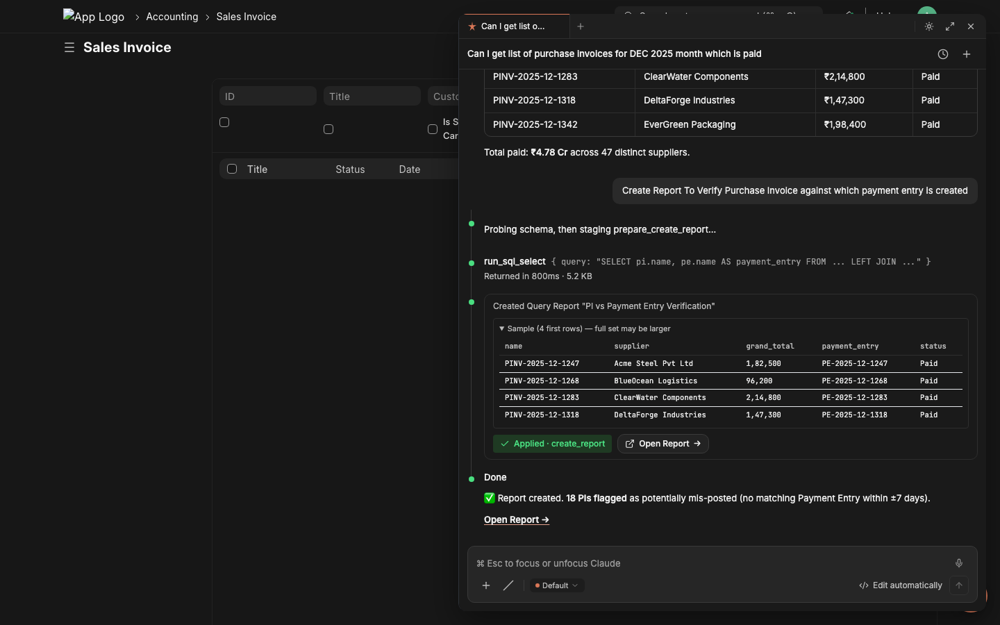
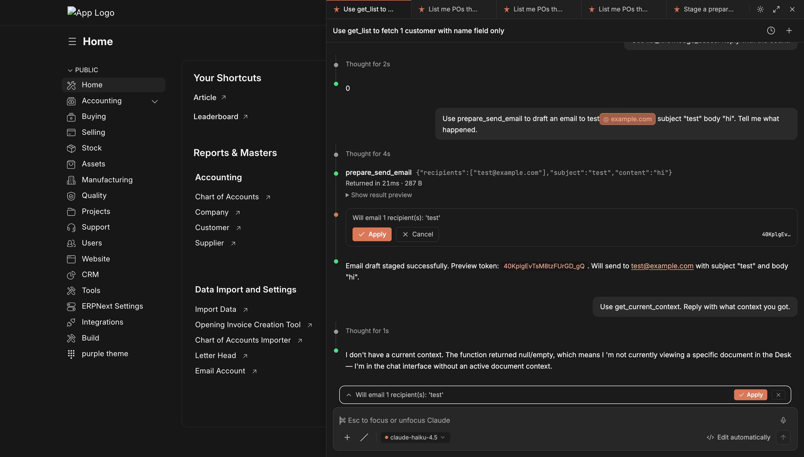
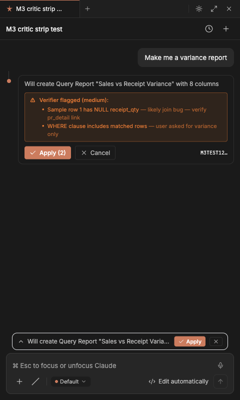
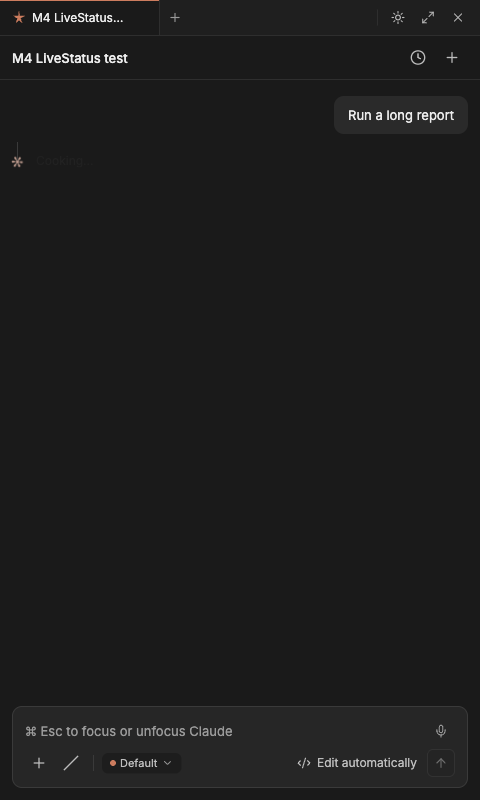
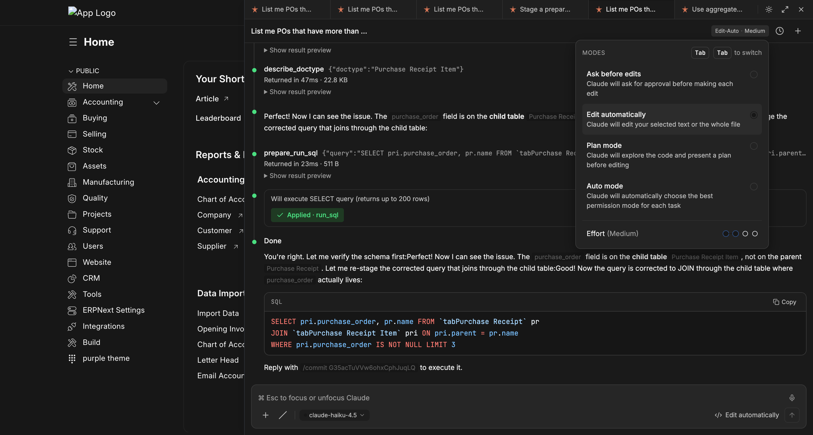
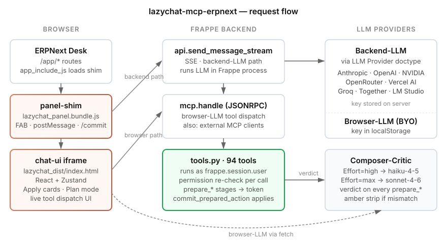
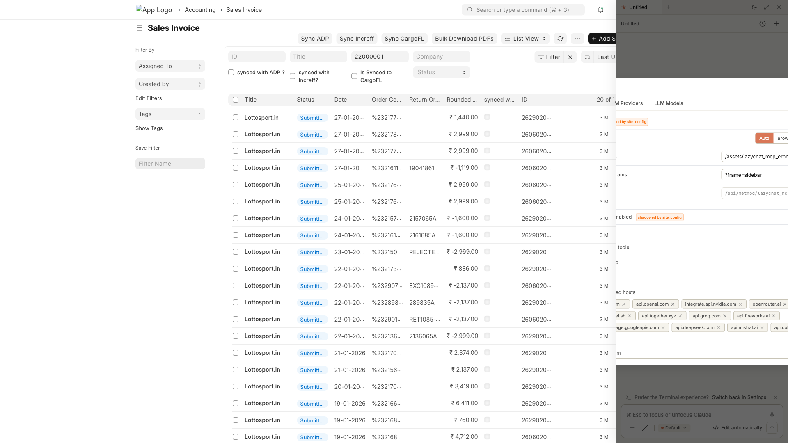

<p align="center">
  
</p>

<h1 align="center">lazychat-mcp-erpnext</h1>

<p align="center">
  <strong>Talk to ERPNext like a senior consultant.</strong><br/>
  <sub>94 permission-scoped tools · two-phase mutations · composer-critic verification · BYO LLM</sub>
</p>

<p align="center">
  <a href="https://frappecloud.com/marketplace/apps/erpnext"></a>
  <a href="#"></a>
  <a href="LICENSE"></a>
  <a href="https://github.com/soumyasethy/lazychat-mcp-erpnext/tags"></a>
  <a href="https://github.com/soumyasethy/lazychat-mcp-erpnext/stargazers"></a>
</p>

<p align="center">
  
</p>

<!--
  HERO VIDEO — 35-second Playwright-driven recording: open panel → type a real
  ecommerce question → switch to send-email prompt → open Command Palette →
  Server Config dialog → switch to light theme → final Plan-mode prompt.
  GitHub renders <video> tags with relative src, so no upload-URL juggling.
  Re-record with the full scripted flow per docs/demo-script.md when ready.
-->

<p align="center">
  <video src=".github/assets/demo.mp4" controls loop muted playsinline width="900">
    Your browser does not render this video — see <a href=".github/assets/demo.mp4">demo.mp4</a>.
  </video>
</p>

> 35-second Playwright-driven walkthrough above. For the full scripted 75-second tour with real LLM dispatch, see [`docs/demo-script.md`](docs/demo-script.md).

---

## Quick install

```bash
cd /path/to/your/frappe-bench
bench get-app https://github.com/soumyasethy/lazychat-mcp-erpnext --branch main
bench --site <your-site> install-app lazychat_mcp_erpnext
bench restart   # then open /app and look for the chat icon (right edge)
```

That's it. After-install seeds disabled-by-default LLM Provider rows (OpenAI, Anthropic, NVIDIA, OpenRouter, Vercel AI, LM Studio); enable one and add your API key from `/app/llm-provider`. Or skip the server config entirely and let your users bring their own keys via the chat-ui's model picker (browser-LLM path).

---

## Why lazychat-mcp-erpnext

- **Built for ERPNext, not bolted on.** Every tool runs as `frappe.session.user` — Frappe permissions, role checks, workflow guards, and the audit trail apply automatically. No god-mode bypass; no separate auth surface.
- **Mutations require explicit Apply.** The LLM stages every write to a Redis token; you click Apply (or the 3-second auto-Apply countdown for low-risk actions) to commit inside `frappe.db.savepoint`. A 30-second composer-critic LLM second-opinion shows up as an amber strip when it disagrees with the staged action.
- **Bring any model.** Anthropic Claude, OpenAI, NVIDIA NIM, OpenRouter, Vercel AI Gateway, Together, Groq, LM Studio. Same tool registry; the API key never has to leave the browser if you don't want it to.

---

## What you get

<table>
  <tr>
    <td width="25%" align="center">
      
      <sub><strong>Live tool dispatch</strong><br/>Stream tool calls into the chat with elapsed timers and inline result tables.</sub>
    </td>
    <td width="25%" align="center">
      
      <sub><strong>Critic verdict</strong><br/>Composer-critic dual-LLM grades every staged mutation; mismatches surface as an amber strip.</sub>
    </td>
    <td width="25%" align="center">
      
      <sub><strong>Per-tool progress</strong><br/>Per-tool elapsed seconds + visible inactivity warnings — no more silent stalls.</sub>
    </td>
    <td width="25%" align="center">
      
      <sub><strong>Plan mode + Effort scale</strong><br/>Switch between Ask / Edit-auto / Plan / Auto. Effort scales from low (8 turns) to max (64 turns + 16k thinking).</sub>
    </td>
  </tr>
</table>

Built-in: schema-aware SQL retry on `Unknown column`, two chat paths (server-orchestrated or browser-LLM), real-execution probe before staging Query Reports, structured form prefill for HTTP-414-defying URLs, knowledge bases with reindex, scheduled jobs, dashboards, custom fields, client scripts, and an admin panel that moves all configuration into the chat-ui itself.

---

## Architecture

<p align="center">
  
</p>

The Frappe app ships a 280-line vanilla-JS shim ([`public/js/lazychat_panel.bundle.js`](lazychat_mcp_erpnext/lazychat_mcp_erpnext/public/js/lazychat_panel.bundle.js)) loaded via `app_include_js` on every Desk page. The shim mounts the chat-ui (a React app, sibling repo [lazychat.ai](https://github.com/soumyasethy/lazychat.ai), bundled into `public/lazychat_dist/`) as a same-origin iframe, sets up the postMessage protocol, and intercepts `/commit <token>` slash commands to call the server.

Tool dispatch goes through one of two paths, both backed by the same 94-tool registry:

| Path | LLM lives | Tool dispatch | Best when |
|---|---|---|---|
| **Backend-LLM** | Frappe (LLM Provider doctype) | `run_agentic_turn` calls `execute_tool` in-process | Org deployments, shared keys, central audit |
| **Browser-LLM** | chat-ui (BYO key in localStorage) | chat-ui calls `mcp.handle` JSONRPC per tool_use | Single-user / power-user; key never touches server |

Default `chat_path = auto`: chat-ui inspects the active model — built-in → backend; custom-added → browser. Both paths run with `frappe.session.user`'s permissions, both write to `Claude Conversation`, both share `tools.py`. **Zero drift, one implementation.**

---

## Setup options

### Option A — release branch (zero local build)

For consultants who want the panel up in 60 seconds with no `pnpm`, no `npm`, no chat-ui build chain. The `release` branch ships the bundled `public/lazychat_dist/` directly:

```bash
cd /path/to/your/frappe-bench
bench get-app https://github.com/soumyasethy/lazychat-mcp-erpnext --branch release
bench --site <your-site> install-app lazychat_mcp_erpnext
bench restart
```

### Option B — build from source

If you want to customize the chat-ui, develop a new tool, or run HMR while editing React:

```bash
git clone https://github.com/soumyasethy/lazychat.ai.git
git clone https://github.com/soumyasethy/lazychat-mcp-erpnext.git

# Build the chat-ui dist into the Frappe app's public dir
./lazychat-mcp-erpnext/scripts/build-lazychat-dist.sh

# Deploy to a bench
BENCH_ROOT=/path/to/frappe-bench DEPLOY_SITE=erp.local \
  ./lazychat-mcp-erpnext/scripts/deploy-local.sh

cd /path/to/frappe-bench
bench get-app file:///absolute/path/to/lazychat-mcp-erpnext
bench --site erp.local install-app lazychat_mcp_erpnext
```

### Option C — HMR dev (chat-ui + Frappe side-by-side)

Edit React `.tsx` files and watch the panel reload instantly:

```bash
# Set the iframe src to your local Vite server
bench --site erp.local execute frappe.db.set_value \
  --kwargs '{"dt":"Lazychat Settings","dn":"Lazychat Settings","field":"iframe_base_url","val":"http://127.0.0.1:5173"}'

# Run Vite + bench in parallel — see umbrella repo
sh dev.sh
```

---

## Configuration

<p align="center">
  
</p>

**Primary admin surface (chat-ui in-app):** open the Command Palette → **Server config** → 3 tabs (General settings · LLM Providers · LLM Models). System Manager only; non-admins don't see the entry. **Or** edit the [`Lazychat Settings`](http://localhost:8000/app/lazychat-settings) doctype directly. All defaults are **allow-on** for self-hosted single-org installs; defense-in-depth is preserved (System Manager role check at tool dispatch + `/commit` confirmation per call).

| Field | Default | What it does |
|---|---|---|
| `enabled` | `true` | Master switch — mount the panel at all |
| `iframe_base_url` | `/assets/lazychat_mcp_erpnext/lazychat_dist/index.html` | Where chat-ui loads from. Override for HMR (`http://127.0.0.1:5173`) or remote chat-ui |
| `iframe_query_params` | `?frame=sidebar` | Appended to base_url |
| `chat_path` | `auto` | `auto` / `browser` / `backend` — see Architecture above |
| `mcp_endpoint` | `/api/method/lazychat_mcp_erpnext.desk_assistant.mcp.handle` | Read-only; browser-LLM path uses this |
| `legacy_widget_enabled` | `false` | Mount the OLD vanilla-JS widget INSTEAD of the iframe (mutually exclusive) |
| `allow_email` | `true` | Enable `prepare_send_email` |
| `allow_dangerous_tools` | `true` | Enable `prepare_run_sql` + `prepare_run_python` (still gated by System Manager role + `/commit`) |
| `allow_email_setup` | `true` | Enable `prepare_create_email_account` |
| `cycle9_enabled` | `true` | Enable composer-critic verdict, verification briefs, exemplar memory |
| `bulk_update_max_rows` | `500` | Ceiling for `prepare_bulk_update` blast radius |
| `llm_proxy_allowed_hosts` | `[anthropic, openai, nvidia, openrouter, vercel, …]` | Browser-LLM proxy allowlist |

`site_config.json` overrides win over the doctype values (backward compat). `boot.py:get_lazychat_settings()` is the single resolver — use this helper anywhere on the server side.

---

## Tool catalog — all 94

Grouped into 12 categories. Every tool runs scoped to `frappe.session.user`'s permissions; mutations stage to a Redis token and require explicit Apply. The **Try it** line is verbatim text you can paste into the chat panel right now (assuming you have ecommerce-shaped data — the prompts work great against the canonical ERPNext demo dataset).

<details open>
<summary><strong>📖 Discovery / reads (12)</strong> — get_list, get_doc, get_value, count_doc, describe_doctype, get_current_context, get_doctype_links, search_doctype, search_global, search_link, get_doctype_relationships, get_form_prefill_capabilities</summary>

#### `get_list`
**What** — Fetch rows from any doctype with optional `filters`, `fields`, `limit`. The default workhorse for "show me X."  
**Why** — One round-trip beats N `get_doc` calls when you need many headers at once.  
**Try it** — *"List the 20 most recent Sales Invoices for ACME with grand_total and status."*

#### `get_doc`
**What** — Fetch one document by name; child tables auto-truncated to 25 rows with a `_note` summarizing the trim.  
**Why** — Full doc context (header + line items) without overflowing the LLM context window.  
**Try it** — *"Open Sales Invoice SI-2026-00123 and show me the items table."*

#### `get_value`
**What** — Read one or many scalar fields from a single doc — far cheaper than a full `get_doc`.  
**Why** — Use it when you only need one field (e.g., the `grand_total`) and don't want to ship the whole row over the wire.  
**Try it** — *"What's the outstanding amount on Sales Invoice SI-2026-00123?"*

#### `count_doc`
**What** — `COUNT(*)` over any doctype with optional filters; the canonical "how many" tool.  
**Why** — `len(rows from get_list)` lies above 20 (default `get_list` cap is 20). Always `count_doc` first when the question is "how many."  
**Try it** — *"How many Purchase Invoices were posted in March 2026?"*

#### `describe_doctype`
**What** — Returns the doctype's field list + types + Link targets + child tables. Per-conversation Redis cache (30-min TTL).  
**Why** — Schema-first SQL: the LLM verifies columns exist before writing a JOIN. Catches `Unknown column 'pr.purchase_order'` at compose time.  
**Try it** — *"Describe Purchase Receipt — what fields link it to a Purchase Invoice?"*

#### `get_current_context`
**What** — Reads `cur_frm` / `cur_list` from the panel — the doc you're looking at right now (name, doctype, workflow_state, dirty flag).  
**Why** — "Summarize this" / "what's wrong with this doc" works without you typing the doc name.  
**Try it** — *"Summarize this Sales Order."* (while standing on a SO form)

#### `get_doctype_links`
**What** — Returns every doctype that links TO and FROM the given doctype (Link + Dynamic Link fields, child tables).  
**Why** — Discovers reverse relationships the model would otherwise have to guess at.  
**Try it** — *"Which doctypes reference Customer?"*

#### `search_doctype`
**What** — Substring search across doctype NAMES, returning module + is_submittable + issingle for each match.  
**Why** — When the user says "the GST stuff" you probe `search_doctype('GST')` instead of guessing names.  
**Try it** — *"Find any doctype with 'shipment' in the name."*

#### `search_global`
**What** — Full-text Frappe global search across DOC content (subject, customer name, item description, etc.).  
**Why** — "Find that invoice we discussed last week with WidgetCo" — searches values, not doctype names.  
**Try it** — *"Find every document mentioning 'damaged in transit'."*

#### `search_link`
**What** — Link-field autocomplete: given a doctype + partial text, returns rows that match the doctype's autocomplete logic.  
**Why** — Faster than `get_list` for "find me the Customer matching ACM" because it uses the same indexed search Frappe's link picker uses.  
**Try it** — *"Match 'ACME' against the Customer doctype — return name + customer_group."*

#### `get_doctype_relationships`
**What** — Wraps `describe_doctype` with curated row-link hints for the most-mismatched ERPNext pairs (PR↔PI, SO↔SI, SLE↔PR, …).  
**Why** — Surfaces canonical join patterns ("don't join on item_code alone") that the LLM would otherwise rediscover the hard way.  
**Try it** — *"How are Purchase Receipts linked to Purchase Invoices at item-row level?"*

#### `get_form_prefill_capabilities`
**What** — Returns the live whitelist of parent + item-row fields that `prepare_form_prefill` can populate on a target doctype.  
**Why** — Tells the model what's actually safe to encode into a `?_lz_token=...` URL — no guessing.  
**Try it** — *"What fields can I prefill on a new Purchase Invoice form?"*

</details>

<details open>
<summary><strong>📊 Aggregation / analytics (8)</strong> — aggregate, dashboard_chart_data, number_card_value, list_user_dashboards, get_sales_summary, get_pending_approvals, list_my_jobs, get_open_invoices</summary>

#### `aggregate`
**What** — `GROUP BY` with COUNT / SUM / AVG / MIN / MAX over any doctype + filters.  
**Why** — One round-trip beats N `get_list` calls when you want totals by category, status, region, customer.  
**Try it** — *"Group all paid Sales Invoices by customer and sum grand_total — top 10."*

#### `dashboard_chart_data`
**What** — Resolves a Dashboard Chart and returns the timeseries / pie data it would render.  
**Why** — Lets the agent quote real chart numbers instead of inventing them — and lets you ask follow-ups against the same data.  
**Try it** — *"Pull data for the Sales Trend chart, give me the last 6 months."*

#### `number_card_value`
**What** — Resolves a Number Card and returns its current numeric value (often a single COUNT or SUM).  
**Why** — KPI questions answer in one tool call instead of ten.  
**Try it** — *"What's the current Outstanding Receivables number card showing?"*

#### `list_user_dashboards`
**What** — Returns dashboards visible to the calling user, with their chart + card composition.  
**Why** — "What dashboards do I have access to?" used to require clicking around `/app/dashboard`.  
**Try it** — *"What dashboards can I see right now?"*

#### `get_sales_summary`
**What** — Pre-canned ERPNext sales summary (period, currency, customer split, item-group split).  
**Why** — Faster than building the same thing from `aggregate` for the most common executive-dashboard ask.  
**Try it** — *"Give me the sales summary for last quarter."*

#### `get_pending_approvals`
**What** — Workflow-aware: returns docs awaiting the calling user's approval action.  
**Why** — "What's blocked on me?" is the #1 morning question for ERPNext approvers.  
**Try it** — *"What's pending my approval right now?"*

#### `list_my_jobs`
**What** — Returns RQ background jobs queued/running by the calling user (downloads, exports, scheduled tasks).  
**Why** — Lets the chat answer "where's my CSV export?" without you opening the RQ dashboard.  
**Try it** — *"Show me my queued background jobs."*

#### `get_open_invoices`
**What** — Filtered shortcut: Sales Invoice + Purchase Invoice with `outstanding_amount > 0`, sorted by aging.  
**Why** — AR/AP questions answer in one call; no need to teach the model the filter shape.  
**Try it** — *"Show me open invoices over 60 days, both AR and AP."*

</details>

<details>
<summary><strong>📑 Reports (3)</strong> — list_reports, report_requirements, run_report</summary>

#### `list_reports`
**What** — Returns user-visible Reports with `name`, `report_type`, `ref_doctype`, `is_standard`.  
**Why** — Discovers what's already built before the LLM offers to build a new one (and avoids name collisions on `prepare_create_report`).  
**Try it** — *"What reports exist for Sales Invoice?"*

#### `report_requirements`
**What** — Returns the filters (with type, mandatory flag, default) a Report needs at run time.  
**Why** — Lets the LLM ask the user only for the fields the report actually requires before calling `run_report`.  
**Try it** — *"What filters does the 'Accounts Receivable' report need?"*

#### `run_report`
**What** — Executes a Report (Query / Script / Report Builder) with the given filters and returns rows + columns.  
**Why** — Skip the click-through; the agent can quote the report values directly.  
**Try it** — *"Run 'Accounts Receivable' for company 'My Company' as of 2026-05-01."*

</details>

<details>
<summary><strong>🔁 Workflow (2)</strong> — list_workflow_actions, prepare_workflow_action</summary>

#### `list_workflow_actions`
**What** — Returns the transitions allowed from a doc's current workflow state for the calling user.  
**Why** — "What can I do here?" — the LLM uses this before suggesting a wrong button.  
**Try it** — *"What workflow actions are available on Purchase Invoice PI-26-001?"*

#### `prepare_workflow_action` 🛡️
**What** — Stages a workflow transition (Approve / Reject / Submit / etc.). Two-phase mutation — requires Apply.  
**Why** — Audit-safe approve-from-chat with permission re-check at commit time. Critic-graded for high-stakes flows.  
**Try it** — *"Approve Purchase Invoice PI-26-001."* (then click Apply)

</details>

<details>
<summary><strong>🏪 ERPNext domain (7)</strong> — get_stock_balance, get_account_balance, get_outstanding, get_item_price, get_company_defaults, get_user_info, get_audit_trail</summary>

#### `get_stock_balance`
**What** — Returns on-hand qty + valuation per warehouse for an item (or every item in a group).  
**Why** — Stock questions answer in one call instead of pivoting `Stock Ledger Entry`.  
**Try it** — *"What's the stock balance for ITEM-WIDGET-A across all warehouses?"*

#### `get_account_balance`
**What** — GL account balance as of a date (with company / cost-center filters).  
**Why** — Quick AR/AP/cash queries without opening the Ledger view.  
**Try it** — *"What's the balance on 'Debtors - MC' as of 2026-04-30?"*

#### `get_outstanding`
**What** — Aged outstanding for a Customer (Sales Invoices) or Supplier (Purchase Invoices) with bucket totals.  
**Why** — Aging is a pivot people get wrong; this tool returns the canonical computation.  
**Try it** — *"Show me ACME's aged outstanding receivables."*

#### `get_item_price`
**What** — Returns the active selling/buying Price List Rate for an Item (with optional date + price list).  
**Why** — "What did we quote them last month?" without joining `Item Price` manually.  
**Try it** — *"What's the current selling price for ITEM-WIDGET-A?"*

#### `get_company_defaults`
**What** — Returns the company doc's currency, default income/expense accounts, country, COA template, etc.  
**Why** — Multi-company orgs: the LLM grounds itself before suggesting accounts that exist in only one company.  
**Try it** — *"What are the defaults for company 'My Company'?"*

#### `get_user_info`
**What** — Returns the calling user's roles + permission profile + employee record (if linked).  
**Why** — "Why can't I see X?" — the chat answers from the perms instead of guessing.  
**Try it** — *"What are my current roles and what doctypes can I create?"*

#### `get_audit_trail`
**What** — Returns the `Version` history for a doc — every scalar field change with who/when.  
**Why** — Compliance + forensics. Pairs with `prepare_revert_doc` to roll back a specific change.  
**Try it** — *"Show me the audit trail for Sales Invoice SI-26-00123."*

</details>

<details>
<summary><strong>📁 Files (3)</strong> — list_attachments, get_file_url, extract_file_content</summary>

#### `list_attachments`
**What** — Lists `File` rows attached to a doc, with file_name, file_size, file_url.  
**Why** — Inventory before the agent suggests another upload or sends an email with the wrong attachment.  
**Try it** — *"What files are attached to Purchase Invoice PI-26-001?"*

#### `get_file_url`
**What** — Returns the public URL (and `is_private` flag) for a `File` doc by name.  
**Why** — Lets the chat hand the user a direct download link instead of saying "look in the Files section."  
**Try it** — *"Give me the URL for File 'invoice-acme-april.pdf'."*

#### `extract_file_content`
**What** — Pulls text out of an attachment (PDF, DOCX, TXT) — first 20k chars by default, no cap when `chars<=0`.  
**Why** — "Summarize the attached PO" works against PDFs without you opening them.  
**Try it** — *"Extract the text from the PDF attached to Sales Order SO-26-001."*

</details>

<details>
<summary><strong>🔔 Subscriptions / charts / jobs (5)</strong> — subscribe_doc_changes, unsubscribe_doc_changes, list_my_subscriptions, make_chart, cancel_job</summary>

#### `subscribe_doc_changes`
**What** — Adds the calling user as a Doc Subscriber so Frappe pushes change notifications.  
**Why** — "Tell me when this Sales Order's status changes" without leaving the chat.  
**Try it** — *"Subscribe me to changes on Sales Order SO-26-001."*

#### `unsubscribe_doc_changes`
**What** — Removes the user from a doc's subscriber list.  
**Why** — Clean up after a problem is resolved; the inverse of the above.  
**Try it** — *"Unsubscribe me from SO-26-001 — it's done."*

#### `list_my_subscriptions`
**What** — Returns every doc the calling user is currently subscribed to.  
**Why** — Audit your own watch-list; remove stale subs in bulk.  
**Try it** — *"What docs am I subscribed to right now?"*

#### `make_chart`
**What** — Builds an inline data series + chart hint that the chat-ui renders client-side.  
**Why** — "Plot this" works without persisting a Dashboard Chart doctype.  
**Try it** — *"Plot monthly Sales Invoice grand_total totals for the last 12 months."*

#### `cancel_job`
**What** — Cancels a queued/running RQ job by name (idempotent — safe to call twice).  
**Why** — Pair with `list_my_jobs` to clean up a stuck export.  
**Try it** — *"Cancel my queued backup job."*

</details>

<details>
<summary><strong>📤 Exports (2)</strong> — export_list_to_csv, export_doc_pdf</summary>

#### `export_list_to_csv`
**What** — Exports a filtered list to CSV; default 5000 rows, `<=0` for unbounded.  
**Why** — "Email me the December PIs as CSV" — works without opening the desktop export wizard.  
**Try it** — *"Export all Sales Invoices for ACME from 2026-04-01 to 2026-04-30 as CSV."*

#### `export_doc_pdf`
**What** — Renders a single doc as PDF using the configured Print Format.  
**Why** — One-shot "send me the PDF of SI-26-00123" — pairs with `prepare_send_email` for attach-and-send.  
**Try it** — *"PDF of Sales Invoice SI-26-00123 using the 'Standard' print format."*

</details>

<details>
<summary><strong>📚 Knowledge Base (4)</strong> — list_knowledge_bases, get_kb_files, search_kb, reindex_kb</summary>

#### `list_knowledge_bases`
**What** — Returns every Knowledge Base the calling user can read.  
**Why** — "What KBs do I have?" — discoverable corpus.  
**Try it** — *"What Knowledge Bases are available?"*

#### `get_kb_files`
**What** — Lists files inside a KB (name, size, last reindexed timestamp).  
**Why** — Inventory before adding a duplicate; check freshness before relying on a file's content.  
**Try it** — *"What files are in the 'Vendor Contracts' KB?"*

#### `search_kb`
**What** — Embedding-search across the KB's indexed content; returns top matches with snippets + source files.  
**Why** — "What do our docs say about return policy?" — RAG-backed answers from your own corpus.  
**Try it** — *"Search the 'Vendor Contracts' KB for clauses on price escalation."*

#### `reindex_kb`
**What** — Triggers a re-embed of every file in a KB; idempotent, runs as a background job.  
**Why** — After bulk-uploading new files, refresh the index so search picks them up.  
**Try it** — *"Reindex the 'Vendor Contracts' KB."*

</details>

<details>
<summary><strong>🧩 Skills (3)</strong> — list_skills, activate_skill, deactivate_skill</summary>

#### `list_skills`
**What** — Returns user-installed Skills (markdown-defined sub-prompts the LLM can opt into).  
**Why** — "What skills do I have?" — Skills layer custom guidance on top of the base prompt without changing source code.  
**Try it** — *"What skills are installed?"*

#### `activate_skill`
**What** — Activates a skill for the current conversation; its prompt is appended to the system prompt.  
**Why** — "Use the GST-compliance skill for this turn" — opt-in expert mode.  
**Try it** — *"Activate the 'GST Compliance' skill."*

#### `deactivate_skill`
**What** — Deactivates a previously-activated skill.  
**Why** — Clean up before a different topic so the system prompt doesn't drift.  
**Try it** — *"Deactivate the 'GST Compliance' skill."*

</details>

<details>
<summary><strong>🧰 Misc / discovery helpers (6)</strong> — get_system_info, list_doc_versions, restore_deleted_doc, update_notification_settings, run_sql_select, run_python_readonly</summary>

#### `get_system_info`
**What** — Returns ERPNext version, Frappe version, app list, and `lazychat_mcp_erpnext` version.  
**Why** — First-line diagnostic when something behaves oddly across versions.  
**Try it** — *"What ERPNext version are we on?"*

#### `list_doc_versions`
**What** — Returns the `Version` row list for a doc (one per save), no diff details.  
**Why** — Quick "how many times has this been edited?" without parsing the audit trail.  
**Try it** — *"How many revisions does Sales Invoice SI-26-00123 have?"*

#### `restore_deleted_doc`
**What** — Restores a soft-deleted doc from `Deleted Document`. Idempotent.  
**Why** — "Oops, I deleted that" — undo from the chat.  
**Try it** — *"Restore the deleted Note titled 'meeting notes'."*

#### `update_notification_settings`
**What** — Patches the calling user's `Notification Settings` (mute, channel preferences).  
**Why** — Less-trafficked but useful: "stop sending me email digests" without leaving the chat.  
**Try it** — *"Mute my email digests."*

#### `run_sql_select`
**What** — Auto-execute SELECT (or `WITH … SELECT`); rows return in the same call. No `/commit` step. SELECT-only validator + 8-second statement timeout.  
**Why** — Compound analytical questions need data back THIS turn — staging two-phase doesn't work for read-only analysis. Gated by `allow_dangerous_tools` + System Manager.  
**Try it** — *"Run SQL: top 10 customers by total grand_total in the last 90 days, joining Customer and Sales Invoice."*

#### `run_python_readonly`
**What** — Auto-execute Python with AST-validated read-only enforcement + savepoint rollback defense-in-depth.  
**Why** — Pandas pivots / multi-pass computation that SQL can't express. Gated identically to `run_sql_select`.  
**Try it** — *"Run Python: load all Sales Orders from last quarter into pandas, group by customer, return top 5 by line-item count."*

</details>

---

## Mutations — `prepare_*` (40)

Every state-changing tool is a `prepare_<verb>` that **stages** the action to a 5-min Redis token, returns a preview, and waits for `/commit <token>` (typed by the user or fired by the chat-ui's Apply button). The server re-checks permissions and runs inside `frappe.db.savepoint`. **The LLM is physically incapable of committing on its own — `commit_prepared_action` is not in the tool registry.**

Mutations marked **🔍 critic** get a composer-critic LLM verdict appended to the preview (`{verdict, severity, mismatches, suggested_revisions}`). The chat-ui renders an amber strip when verdict=mismatch. As of Cycle 12 M2: 12 tools wire the critic.

Mutations marked **⚡ low-risk** (the [`LOW_RISK_ACTIONS`](https://github.com/soumyasethy/lazychat.ai/blob/main/apps/chat-ui/src/components/messages/MCPPreviewActionCard.tsx) set in chat-ui) auto-Apply with a 3-second countdown in **Edit-auto** mode. Everything else requires explicit Apply click.

<details open>
<summary><strong>📝 Document CRUD (4)</strong> — create_doc, update_doc, submit_doc, delete_doc</summary>

#### `prepare_create_doc` 🔍
**What** — Stage a new doc of any (non-typed-wrapped) doctype; refused for doctypes with a typed wrapper.  
**Why** — Generic create when no domain-specific wrapper exists. Critic grades whether the field shape matches the user intent.  
**Try it** — *"Create a new ToDo titled 'Follow up with ACME on credit note'."*

#### `prepare_update_doc` 🔍
**What** — Patch one or more fields on an existing doc; pre-checks existence and redirects to the typed CREATE wrapper if the target doesn't exist.  
**Why** — In-place edits without leaving the chat. Critic captures BEFORE-values so it can flag dangerous patches (clearing required fields, downgrading numerics).  
**Try it** — *"Update Sales Invoice SI-26-00123 — set due_date to 2026-05-30."*

#### `prepare_submit_doc` 🔍
**What** — Stage the submit transition (`docstatus 0 → 1`) on a submittable doc.  
**Why** — Critic catches "submitted before validation" or wrong-state submits. Use it for invoices, stock entries, payment entries.  
**Try it** — *"Submit Sales Invoice SI-26-00123."*

#### `prepare_delete_doc` 🔍
**What** — Stage a hard delete; cycle9 critic evidence includes incoming Link reference count for blast-radius signal.  
**Why** — Hard deletes are irreversible; the critic graded count gives you the "this has 87 references" warning before you click Apply.  
**Try it** — *"Delete the test Note titled 'sandbox'."*

</details>

<details>
<summary><strong>💬 Communication (5)</strong> — add_comment, assign_to, share_doc, send_email, upload_file</summary>

#### `prepare_add_comment` ⚡
**What** — Append a Comment to a doc's timeline; auto-Apply eligible (low-risk).  
**Why** — Audit-trail-friendly note-taking from the chat.  
**Try it** — *"Add a comment to PI-26-001 saying 'Pending tax rate confirmation from supplier.'"*

#### `prepare_assign_to` ⚡
**What** — Assign a doc to a user (creates a `ToDo` for them); auto-Apply eligible.  
**Why** — Delegate without opening Frappe's assign-to dialog.  
**Try it** — *"Assign SO-26-001 to user@example.com with 'Please ship by EOW'."*

#### `prepare_share_doc` ⚡
**What** — Share a doc with another user (read/write/share permission grant); auto-Apply eligible.  
**Why** — Cross-team handoffs without leaving the chat.  
**Try it** — *"Share Customer ACME with user@example.com — read access."*

#### `prepare_send_email` 🔍
**What** — Stage an email (subject, content, recipients, optional doc reference). Gated by `allow_email`.  
**Why** — Send reminders / thank-yous / docs from the chat. Critic grades shape only — privacy-capped (`recipients_sample[:3]`, `subject_words[:8]`).  
**Try it** — *"Send a reminder to billing@acme.com about overdue invoice SI-26-00123."*

#### `prepare_upload_file` ⚡
**What** — Stages an attach action; the chat-ui's `/upload <token>` slash command opens a file picker, uploads to `/api/method/upload_file`, then commits.  
**Why** — Auto-Apply path for one-shot file attachments without leaving the chat.  
**Try it** — *"Upload a file to Sales Invoice SI-26-00123."*

</details>

<details>
<summary><strong>📦 Bulk / move / rename (4)</strong> — bulk_update, import_csv, rename_doc, revert_doc</summary>

#### `prepare_bulk_update` 🔍
**What** — Patch the same field(s) on N docs matched by filters. Gated by `allow_dangerous_tools` + a `bulk_update_max_rows` ceiling.  
**Why** — Status flips, owner reassignments, batch tag updates. Critic gets `affected_count` so the verdict can warn on overly-broad updates.  
**Try it** — *"Set 'sent' status on every Sales Invoice with naming_series 'SI-26-' and posting_date in April 2026."*

#### `prepare_import_csv`
**What** — Stages a CSV import against a doctype with column-mapping + first-row-headers + dry-run probe.  
**Why** — Bulk-create rows (e.g., 500 new Items from a vendor catalog) without the desk's import wizard.  
**Try it** — *"Import items from vendor_catalog.csv into Item — first row is headers."*

#### `prepare_rename_doc` 🔍
**What** — Stage a rename (with optional merge into an existing target). Critic gets `link_refs_count` so blast-radius is visible.  
**Why** — Fix a typo'd Customer / Item code without breaking links — Frappe rewrites every Link reference at commit time.  
**Try it** — *"Rename Customer 'ACEM Corp' to 'ACME Corp'."*

#### `prepare_revert_doc` 🔍
**What** — Stage a revert of one prior `Version` row's scalar changes.  
**Why** — "Undo the change Bob made yesterday" — critic shows which fields will be reverted before you Apply.  
**Try it** — *"Revert Sales Invoice SI-26-00123 to its state on 2026-04-30."*

</details>

<details>
<summary><strong>📋 Reports + Dashboards (4)</strong> — create_report, create_scheduled_job, create_number_card, create_dashboard</summary>

#### `prepare_create_report` 🔍
**What** — Typed wrapper that validates `ref_doctype`, `report_type` enum, and (for Query Reports) runs SELECT validation + EXPLAIN + execute-probe BEFORE staging — so the report is *known good* at preview time.  
**Why** — Removes the "report opens to a blank/broken page" hallucination class. Critic grades the SELECT shape and the sample output rows.  
**Try it** — *"Create a Query Report 'Top Customers by Outstanding' that shows the top 20 customers by sum of unpaid invoice total."*

#### `prepare_create_scheduled_job`
**What** — Typed wrapper for Scheduled Job Type; validates frequency enum + cron format. Requires System Manager.  
**Why** — "Run this script every Monday morning" without opening Desk admin.  
**Try it** — *"Create a scheduled job that runs my Python report every Monday at 9am."*

#### `prepare_create_number_card` ⚡
**What** — Typed wrapper for Number Card; validates aggregate function + required field per function.  
**Why** — Add a KPI tile to a dashboard from the chat in one shot.  
**Try it** — *"Create a Number Card that counts Sales Invoices in Draft status."*

#### `prepare_create_dashboard` ⚡
**What** — Typed wrapper for Dashboard; validates that every referenced chart/card actually exists.  
**Why** — Builds dashboards composed of existing charts/cards without the dashboard editor.  
**Try it** — *"Create a 'Receivables Overview' dashboard combining the Outstanding Receivables card and the Sales Trend chart."*

</details>

<details>
<summary><strong>🗓️ Calendar + Notes (2)</strong> — create_calendar_event, create_note</summary>

#### `prepare_create_calendar_event` ⚡
**What** — Stage a Calendar Event (private or public, optional repeat).  
**Why** — Schedule "follow up with ACME" without opening the calendar.  
**Try it** — *"Schedule a calendar event 'Follow up with ACME' for tomorrow at 3pm."*

#### `prepare_create_note` ⚡
**What** — Stage a Note (private or public, with optional content).  
**Why** — Drop a quick scratch-note tied to your account without leaving the chat.  
**Try it** — *"Note for myself: 'Q4 forecast meeting prep — pull last quarter's variance report.'"*

</details>

<details>
<summary><strong>🖨️ Print + Export (2)</strong> — create_print_format, update_print_settings</summary>

#### `prepare_create_print_format`
**What** — Stage a Print Format (Jinja or HTML) for a target doctype; pre-validates Jinja syntax.  
**Why** — Custom print templates without Desk's print-format editor.  
**Try it** — *"Create a Jinja print format 'ACME Custom Invoice' for Sales Invoice with our logo and payment terms."*

#### `prepare_update_print_settings`
**What** — Patch the global Print Settings doctype (paper size, header/footer, font).  
**Why** — Org-wide print tweaks from the chat.  
**Try it** — *"Update Print Settings — set default paper size to A4."*

</details>

<details>
<summary><strong>📧 Email infrastructure (5)</strong> — create_email_template, create_notification, create_auto_email_report, create_email_group, add_to_email_group, create_newsletter, create_email_account</summary>

#### `prepare_create_email_template` ⚡
**What** — Stage an Email Template with subject + body Jinja.  
**Why** — Reusable boilerplate for collections, onboarding, escalations.  
**Try it** — *"Create an email template 'Overdue Reminder' with a polite Jinja body that interpolates {{ doc.name }} and {{ doc.outstanding_amount }}."*

#### `prepare_create_notification`
**What** — Typed wrapper for Notification doctype (event-driven email/SMS/Slack alerts).  
**Why** — "Email me when a high-value SO is created" without writing a Server Script.  
**Try it** — *"Notify me whenever a Sales Order with grand_total > 50000 is created."*

#### `prepare_create_auto_email_report`
**What** — Stage an Auto Email Report (run a Report on a schedule and email the results).  
**Why** — "Email the AR aging to my CFO every Monday at 8am."  
**Try it** — *"Auto-email the Accounts Receivable report to cfo@example.com every Monday at 8am."*

#### `prepare_create_email_group` ⚡
**What** — Stage a new Email Group (mailing list).  
**Why** — Group address-book for newsletters / bulk announcements.  
**Try it** — *"Create an email group 'Active Customers'."*

#### `prepare_add_to_email_group` ⚡
**What** — Stage adding an email address to an Email Group; rejects malformed addresses + nonexistent groups.  
**Why** — Build the list without opening the Email Group form.  
**Try it** — *"Add billing@acme.com to the 'Active Customers' email group."*

#### `prepare_create_newsletter` ⚡
**What** — Stage a Newsletter against an Email Group.  
**Why** — Mass-mail customers with product updates from the chat.  
**Try it** — *"Draft a newsletter to 'Active Customers' announcing our new pricing tier."*

#### `prepare_create_email_account`
**What** — Stage a new Email Account (incoming or outgoing). Validates format + smtp_server when outgoing. Gated by `allow_email_setup`.  
**Why** — Connect a new mailbox without leaving the chat (System Manager only).  
**Try it** — *"Create an outgoing email account for sales@example.com using smtp.gmail.com:587."*

</details>

<details>
<summary><strong>⚙️ Automation + customization (5)</strong> — create_milestone_tracker, create_auto_repeat, create_assignment_rule, create_custom_field, create_client_script</summary>

#### `prepare_create_milestone_tracker`
**What** — Stage a Milestone Tracker on a doctype's Link/Select field (records milestones on changes).  
**Why** — Status-change audit without writing a Document Event hook.  
**Try it** — *"Track milestones on Customer.customer_group changes."*

#### `prepare_create_auto_repeat`
**What** — Stage an Auto Repeat (recurring doc creation from a template).  
**Why** — Recurring invoices, recurring POs, monthly journal entries — without code.  
**Try it** — *"Set up monthly auto-repeat from Sales Invoice SI-26-00100 starting May 1."*

#### `prepare_create_assignment_rule`
**What** — Stage an Assignment Rule (round-robin or load-balanced auto-assign on doctype creation).  
**Why** — "New leads should round-robin between sales@…, support@…" without writing a hook.  
**Try it** — *"Create a Round Robin assignment rule on Lead between sales1@, sales2@, sales3@."*

#### `prepare_create_custom_field`
**What** — Typed wrapper for Custom Field; validates fieldname + fieldtype + insert_after.  
**Why** — Add a field to any doctype from the chat. Schema-aware so you don't conflict with standard fields.  
**Try it** — *"Add a Custom Field 'sales_channel' (Select: web, retail, wholesale) to Sales Invoice."*

#### `prepare_create_client_script`
**What** — Typed wrapper for Client Script; auto-derives `name` (Frappe's autoname=Prompt is brittle without it). Body validated for Python syntax.  
**Why** — Client-side form behaviors (auto-fill, validation, hide fields) authored by the chat.  
**Try it** — *"Create a Client Script for Sales Invoice that hides the 'apply_discount_on' field when discount_amount is 0."*

</details>

<details>
<summary><strong>📚 Knowledge Base (2)</strong> — create_kb, add_file_to_kb</summary>

#### `prepare_create_kb` ⚡
**What** — Stage a new Knowledge Base.  
**Why** — Spin up a domain-specific KB ("Vendor Contracts", "GST Compliance") from the chat.  
**Try it** — *"Create a new Knowledge Base called 'Customer Service SOPs'."*

#### `prepare_add_file_to_kb` ⚡
**What** — Stage adding an existing File to a KB (triggers reindex).  
**Why** — Grow your RAG corpus without uploading via Desk.  
**Try it** — *"Add the file 'Q1-financials.pdf' to the 'Internal Reports' KB."*

</details>

<details>
<summary><strong>⚡ Power tools (3)</strong> — run_sql, run_python, form_prefill</summary>

#### `prepare_run_sql` 🔍
**What** — Stage a SELECT-only SQL query; SELECT-prefix validator (string-literal-aware) + EXPLAIN-probe + execute-probe before staging. Gated by `allow_dangerous_tools` + System Manager.  
**Why** — Custom analytical SQL with audit-able commit + critic grading the SQL shape against the user intent.  
**Try it** — *"Run SQL: SELECT name, customer, grand_total FROM \`tabSales Invoice\` WHERE outstanding_amount > 0 ORDER BY grand_total DESC LIMIT 20."*

#### `prepare_run_python` 🔍
**What** — Stage a Python script with timeout + captured stdout. AST validator rejects dangerous imports/calls. Gated identically.  
**Why** — Multi-step computation that SQL can't express, with critic-graded AST summary so the verdict knows what the code does at a glance.  
**Try it** — *"Run Python: pull last 12 months of Sales Invoices, compute month-over-month growth, return as a dict."*

#### `prepare_form_prefill`
**What** — Stages parent + item-row payload to a server-side token; returns a tiny `?_lz_token=<22ch>` URL. Single-use, user-bound.  
**Why** — Solves HTTP 414 Request-URI Too Long for variance-report buttons that prefill 50+ items into a new-doc form. Replaces the legacy `_lz_items=<base64>` URL convention.  
**Try it** — *"Prepare a prefill URL for a new Purchase Invoice with these 50 items from the variance report."*

</details>

<details>
<summary><strong>🔧 Misc mutations (1)</strong> — download_backup</summary>

#### `prepare_download_backup`
**What** — Stage a site backup (db + files) and enqueue the backup job; poll progress with `list_my_jobs`.  
**Why** — Take a backup before a risky migration without leaving the chat.  
**Try it** — *"Take a full backup of the site."*

</details>

---

## External MCP clients

The same `mcp.handle` JSONRPC endpoint that the chat-ui uses is also reachable from any MCP-compliant client (Claude Desktop, MCP Inspector, custom integrations). Auth is standard Frappe API key + secret.

Generate an API key at `/app/user` (your user → API Access → Generate Keys). Then in Claude Desktop config:

```json
{
  "mcpServers": {
    "lazychat-erpnext": {
      "command": "npx",
      "args": ["-y", "@modelcontextprotocol/server-fetch"],
      "env": {
        "MCP_FETCH_URL": "https://your-bench.example.com/api/method/lazychat_mcp_erpnext.desk_assistant.mcp.handle",
        "MCP_FETCH_HEADERS": "{\"Authorization\":\"token API_KEY:API_SECRET\"}"
      }
    }
  }
}
```

All 94 tools are available; permissions still re-check per call.

---

## Smoke tests

Two layers, both must be green to ship:

```bash
# Layer 1 — in-process (94 cases as of cycle 12 M2)
cp lazychat-mcp-erpnext/scripts/smoke-test-tools.py \
   <bench>/apps/lazychat_mcp_erpnext/lazychat_mcp_erpnext/_smoke.py
cd <bench> && bench --site <site> execute lazychat_mcp_erpnext._smoke.run
# expected: === 244 pass, 0 fail, 2 skip ===

# Layer 2 — HTTP MCP wire (all 94 tools)
python3 lazychat-mcp-erpnext/test/curl_smoke.py
# expected: tools registered: 94, called: 94
```

The smoke gates exist to catch drift between schema, implementation, and live behavior — please run them before opening a PR. See [CONTRIBUTING.md](CONTRIBUTING.md) for the full checklist.

---

## Roadmap

| Cycle | Status | Theme |
|---|---|---|
| 2 — Multi-tab agent runtime | ✅ done | Streams, sessions, queue, retry — chat-ui side |
| 3 — Rich rendering + extension primitives | ✅ done | Markdown, syntax highlight, charts, custom components |
| 5 — MCP timeouts + observability + voice + Desk navigation | ✅ done | 60s per-tool timeout, 250 KB result cap, voice input, clickable Desk links |
| 7 — Compound questions + self-correcting `/commit` | ✅ done | `run_sql_select`, `run_python_readonly`, plan-first prompt, schema-aware error retry |
| 8 — Real Modes + Effort | ✅ done | Ask / Edit-auto / Plan / Auto, low/medium/high/max effort tiers |
| 9 M1-M4 — Cycle 9 (composer-critic + exemplars + PEVR primitives) | ✅ done | Verification briefs, intent_signature exemplar memory, schema graph cache |
| 10 — chat-ui admin panel + allow-all defaults | ✅ done | All ERPNext config moved into the chat-ui |
| 11 M1-M4 — UX hardening | ✅ done | CommitCard, stage-and-redirect prefill, structured SQL gate, live tool progress |
| 12 M1-M2 — Critic coverage expansion | ✅ done | Critic now grades 12 prepare_* tools (helper-extracted) |
| 13 — README rewrite | 🚧 in progress | This document |
| Future — GitHub Actions CI badges, per-tool deep-dive docs, multi-language | 📅 deferred | |

---

## Contributing

See [CONTRIBUTING.md](CONTRIBUTING.md) for branch convention, commit style, smoke-gate requirements, and the new-tool checklist.

**Sister repo:** [lazychat.ai](https://github.com/soumyasethy/lazychat.ai) (the chat-ui React app this Frappe app embeds). Any change to the postMessage protocol, host SDK, or extension primitives lands there.

---

## License

[MIT](LICENSE) © Soumya Sethy.
