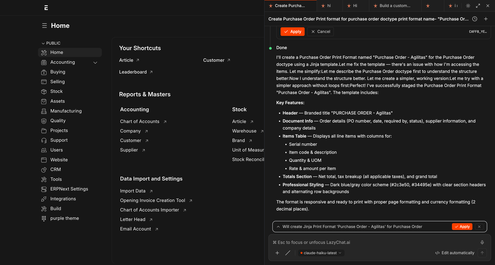
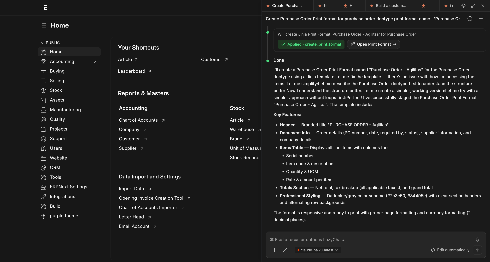
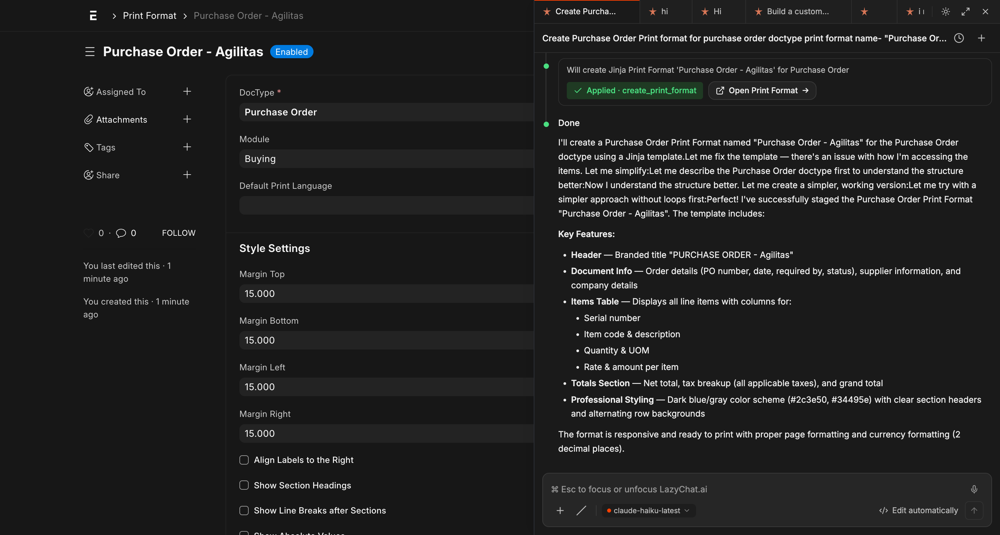

<div align="center">


# lazychat-erpnext

**Talk to ERPNext like a senior consultant.**

<sub>95 permission-scoped tools · two-phase mutations · composer-critic verification · BYO LLM</sub>

<br/>

    

</div>

<br/>

<!--
  HERO VIDEO — 78s Playwright-driven flagship recording at 1440×900.
  Story arc: Hook (4s) → Agitate (6s) → Open + type Q1 (8s) → Tool dispatch
  + 324-row result table (14s) → Q2 plan + Apply + report URL (23s) →
  BYO LLM curl-paste (15s) → CTA (10s). All chat content via synthetic
  postMessage injection — DemoCo Industries data only, zero brand leak.
  Spec: docs/superpowers/specs/2026-05-10-flagship-marketing-video.md
-->

<div align="center">

<!--
  Hero banner — animated GIF of the 78s walkthrough.
  Why GIF instead of <video>: GitHub's <video> tag is unreliable on private
  repos (raw URLs need auth, browsers block cross-origin autoplay). GIFs
  use  which renders + loops + autoplays unconditionally everywhere.
  5.6 MB at 880px / 12fps; the full HD MP4 is still committed for download.
-->

<br/>
<sub>↑ <strong>78-second flagship walkthrough</strong> — stakeholder ask → tool dispatch → report URL → BYO LLM in one shot. (Want HD? <a href="https://raw.githubusercontent.com/soumyasethy/lazychat-erpnext/main/.github/assets/demo.mp4">▶ download the MP4</a>.)</sub>
<br/><br/>

<br/>
<sub>↑ Still hero — the post-dispatch state of the panel, mid-conversation.</sub>
</div>

## From stakeholder request to delivered report — in minutes

> *"Hey, I need to verify which December purchase invoices have payment entries against them. Can we get a report by EOD?"*

That ask used to mean opening 3 Frappe doctypes, writing a custom Query Report, debugging joins, fixing field names, and probably a meeting. With lazychat, the consultant types the stakeholder's words verbatim into the chat panel.

<table>
  <tr>
    <td width="50%" valign="top">
      <strong>Step 1 — Type the stakeholder's request</strong><br/>
      <sub>The consultant pastes the verbatim ask into the chat composer.</sub>
      <br/><br/>
      
    </td>
    <td width="50%" valign="top">
      <strong>Step 2 — Lazychat dispatches tools, returns data</strong><br/>
      <sub><code>describe_doctype</code> → <code>run_sql_select</code> → inline result table. Real data. No copy-pasting from <code>/api/method</code>.</sub>
      <br/><br/>
      
    </td>
  </tr>
  <tr>
    <td width="50%" valign="top">
      <strong>Step 3 — Stage the report, click Apply</strong><br/>
      <sub><code>prepare_create_report</code> validates the SQL via execute-probe, shows sample rows, the critic LLM grades it. One click commits.</sub>
      <br/><br/>
      
    </td>
    <td width="50%" valign="top">
      <strong>Step 4 — Share the URL with the stakeholder</strong><br/>
      <sub>Copy the report URL. Done. <strong>Time elapsed: ~2 minutes.</strong></sub>
      <br/><br/>
      The same flow works for cross-doctype reconciliations, variance reports, ad-hoc audits, and bulk operations. <strong>95 permission-scoped tools</strong> back the chat — see the catalog below for what each can do.
    </td>
  </tr>
</table>

---

## Bring your own LLM in 30 seconds

Self-hosted LM Studio? Anthropic? NVIDIA NIM? OpenRouter? Together? Groq? You don't fill out a form. You **paste a `curl` snippet from the provider's own docs** — and lazychat parses it into endpoint, model, auth, headers, streaming flag, even provider-specific payload extras. **The API key stays in the browser** (browser-LLM path); no server-side credential storage, no shared org-key risk.

### The 4-step flow

<table>
  <tr>
    <td width="50%" valign="top" align="center">
      
      <br/><sub><strong>1. Open the model picker</strong><br/>From the chat composer, click the model chip (bottom-left) → <em>+ Add custom model</em>.</sub>
    </td>
    <td width="50%" valign="top" align="center">
      
      <br/><sub><strong>2. Paste any provider's curl into the right-hand panel</strong><br/>Endpoint, model, auth, format, streaming, max_tokens, temperature, top_p, extra headers, extra payload — all auto-fill on the left.</sub>
    </td>
  </tr>
  <tr>
    <td width="50%" valign="top" align="center">
      
      <br/><sub><strong>3. Click Test connection → green ✓ → Add model</strong><br/>Test connection makes a 1-token probe request, shows the HTTP status + first 800 chars of the response. Green check = ready to ship.</sub>
    </td>
    <td width="50%" valign="top" align="center">
      
      <br/><sub><strong>4. Switch instantly, per session</strong><br/>Custom models appear under a <em>CUSTOM</em> section in the picker. Click to switch — the chat composer's model chip updates immediately. Mix free / paid / local on different chats.</sub>
    </td>
  </tr>
</table>

### Tested provider snippets (paste these verbatim)

<details>
<summary><strong>NVIDIA NIM</strong> — auto-detects OpenAI format, picks up <code>chat_template_kwargs</code> for thinking-mode</summary>

```bash
curl -X POST "https://integrate.api.nvidia.com/v1/chat/completions" \
  -H "Authorization: Bearer nvapi-..." \
  -H "Accept: text/event-stream" \
  -H "Content-Type: application/json" \
  -d '{
    "model": "moonshotai/kimi-k2.6",
    "messages": [{"role":"user","content":""}],
    "max_tokens": 16384,
    "temperature": 1.0,
    "stream": true,
    "chat_template_kwargs": {"thinking": true}
  }'
```

Auto-fills label `Kimi K2 (NVIDIA)`, endpoint, format=`openai`, streaming=✓, bearer token, max_tokens, temperature, plus `chat_template_kwargs` lands in the **Extra payload** field verbatim.
</details>

<details>
<summary><strong>Anthropic (direct, no Frappe LLM Provider needed)</strong> — auto-detects messages format + <code>x-api-key</code> auth</summary>

```bash
curl https://api.anthropic.com/v1/messages \
  -H "x-api-key: sk-ant-..." \
  -H "anthropic-version: 2023-06-01" \
  -H "Content-Type: application/json" \
  -d '{
    "model": "claude-haiku-4-5",
    "max_tokens": 4096,
    "stream": true,
    "messages": [{"role":"user","content":""}]
  }'
```

Auth type → `API Key`, header name → `x-api-key`, format → `anthropic`, response parser → `anthropic-sse`. The custom `anthropic-version` header lands in **Extra headers**.
</details>

<details>
<summary><strong>OpenAI</strong></summary>

```bash
curl https://api.openai.com/v1/chat/completions \
  -H "Authorization: Bearer sk-..." \
  -H "Content-Type: application/json" \
  -d '{"model":"gpt-5","messages":[{"role":"user","content":""}],"stream":true}'
```
</details>

<details>
<summary><strong>OpenRouter</strong> — gateway to 200+ models</summary>

```bash
curl https://openrouter.ai/api/v1/chat/completions \
  -H "Authorization: Bearer sk-or-..." \
  -H "HTTP-Referer: https://your-site.example.com" \
  -H "X-Title: Lazychat" \
  -d '{"model":"meta-llama/llama-3.3-70b-instruct","stream":true}'
```

The `HTTP-Referer` and `X-Title` extras are required by OpenRouter and land in **Extra headers**.
</details>

<details>
<summary><strong>LM Studio (localhost)</strong> — fully local, no API key</summary>

```bash
curl http://localhost:1234/v1/chat/completions \
  -H "Content-Type: application/json" \
  -d '{"model":"meta-llama-3-8b-instruct","stream":true}'
```

Auth type → `none`, format → `openai`, streaming → ✓. Browser-LLM path makes localhost work because requests originate from the user's browser, not the Frappe server.
</details>

### What the parser auto-fills from the curl

| Curl part | Form field |
|---|---|
| `https://api.anthropic.com/v1/messages` | URL ends `/messages` → **Format** = `anthropic` |
| `https://*/v1/chat/completions` | URL ends `/chat/completions` → **Format** = `openai` |
| `-H "Authorization: Bearer XYZ"` | **Auth type** = Bearer; **Token** = `XYZ` |
| `-H "x-api-key: XYZ"` | **Auth type** = API Key; **Header name** = `x-api-key`; **Token** = `XYZ` |
| `-H "Accept: text/event-stream"` | **Streaming** = ✓ |
| Any other `-H "X: Y"` (e.g. `anthropic-version`, `HTTP-Referer`) | **Extra headers** (kv list) |
| Payload `"model":"X"` | **Model** = `X` |
| Payload `"max_tokens":N` / `"temperature":N` / `"top_p":N` | **Defaults** block |
| Payload `"stream":true` | **Streaming** = ✓ |
| Any payload key not in the above | **Extra payload** (preserved as JSON, merged into request body verbatim) |
| Hostname (`api.anthropic.com`) | **Label** auto-generated as `Anthropic Direct`-style title |

> **Test connection** sends one `messages: [{"role":"user","content":""}]` request to the configured endpoint with the parsed auth + extras. Returns the HTTP status + first 800 chars of the response body in a green/red panel — instant proof the credential and endpoint work before you start using the model in real chats.

> Same auto-fill works for `requests.post(...)` snippets too — paste a Python snippet from a provider's quickstart and it parses identically.

---

## Charts and dashboards rendered in-chat

Tools like `make_chart`, `dashboard_chart_data`, and `number_card_value` don't return raw JSON to the user — the chat-ui's `ChartBlock` renders them inline as proper Vega charts and KPI cards, in the panel, alongside the conversation. The consultant asks *"chart of paid PIs by month"* and the chart appears as the answer. No tab-switching, no exporting to a BI tool, no Frappe Dashboard form-filling.

<table>
  <tr>
    <td width="50%" valign="top">
      
    </td>
    <td width="50%" valign="top">
      
    </td>
  </tr>
  <tr>
    <td width="50%" valign="top">
      
    </td>
    <td width="50%" valign="top">
      
    </td>
  </tr>
</table>

> Bar / line / area / donut / scatter all map to Frappe Charts via the `make_chart` tool. Multi-chart dashboards (with cards + charts grouped) ship via `prepare_create_dashboard` — you ask, lazychat stages, you click Apply, the dashboard appears at `/app/dashboard-view/<name>` ready to bookmark.

---

## How tool results render in the chat

Tool calls don't return raw JSON dumps to the user. Lazychat's response renderer formats the LLM's reply using the full markdown stack — GitHub-flavored tables, syntax-highlighted code with [shiki](https://shiki.style/), [mermaid](https://mermaid.js.org/) diagrams, KaTeX math, blockquote callouts, structured headings — so a "tool result" reads like an answer, not a debug log.

<table>
  <tr>
    <td width="50%" valign="top">
      <strong>Markdown tables — currency-aligned columns + status badges</strong><br/>
      <sub>The LLM emits a plain markdown table; the renderer auto-aligns numerics, bolds important columns, and inlines emoji status pills (🟢 OK / 🟠 Watch / 🔴 Overdue).</sub>
      <br/><br/>
      
    </td>
    <td width="50%" valign="top">
      <strong>Code blocks — full shiki highlighting + Copy button</strong><br/>
      <sub>SQL / Python / TypeScript / JSON all light up with the same theme tokens as the surrounding panel. Language tag in the corner, Copy button inset, inline code spans (<code>`like this`</code>) keep the same palette.</sub>
      <br/><br/>
      
    </td>
  </tr>
  <tr>
    <td width="50%" valign="top">
      <strong>Mermaid diagrams — relationships + flows in-chat</strong><br/>
      <sub>The LLM ships a <code>```mermaid</code> fence; the renderer lazy-loads mermaid, applies the panel's brand-orange theme, and you get a real ER diagram or flowchart inline. Better than 200 words of "see, the join is..."</sub>
      <br/><br/>
      
    </td>
    <td width="50%" valign="top">
      <strong>Structured prose — headings, lists, blockquote callouts</strong><br/>
      <sub>For analytical answers the LLM uses real document structure: H3 sub-headings, ordered lists with bold labels, italic emphasis, blockquote callouts for the recommended next action. The renderer applies the typographic hierarchy.</sub>
      <br/><br/>
      
    </td>
  </tr>
</table>

> Plus: KaTeX math (for reconciliation formulas), JSON tree expanders for raw tool outputs, automatic link-card previews for any URL the LLM cites, attachment renders for `extract_file_content` PDF/DOCX/CSV outputs, and a streaming markdown parser that keeps tables and code blocks structurally valid mid-token. The tool gives the data; the renderer makes it readable.

---

## Install

**Frappe Cloud:** install from the marketplace in one click.

**Self-hosted bench:** see **[INSTALL.md](INSTALL.md)** — the standard `bench` install (the pre-built chat-ui ships with the app, so no build step needed), building from source, and HMR dev are all documented there.

After install, the app seeds disabled-by-default LLM Provider rows (OpenAI, Anthropic, NVIDIA, OpenRouter, Vercel AI, LM Studio) — enable one and add your API key from `/app/llm-provider`, or skip server-side config entirely and let users bring their own keys via the chat-ui's model picker (browser-LLM path).

---

## Why lazychat-erpnext

- **Built for ERPNext, not bolted on.** Every tool runs as `frappe.session.user` — Frappe permissions, role checks, workflow guards, and the audit trail apply automatically. No god-mode bypass; no separate auth surface.
- **Mutations require explicit Apply.** The LLM stages every write to a Redis token; you click Apply (or the 3-second auto-Apply countdown for low-risk actions) to commit inside `frappe.db.savepoint`. A 30-second composer-critic LLM second-opinion shows up as an amber strip when it disagrees with the staged action.
- **Bring any model.** Anthropic Claude, OpenAI, NVIDIA NIM, OpenRouter, Vercel AI Gateway, Together, Groq, LM Studio. Same 95-tool registry; the API key never has to leave the browser if you don't want it to.

---

## What you get

<table>
  <tr>
    <td width="50%" valign="top" align="center">
      
      <br/><sub><strong>Live tool dispatch</strong><br/>Watch the agent fetch real data with elapsed timers and inline result tables. No copy-pasting from <code>/api/method</code>.</sub>
    </td>
    <td width="50%" valign="top" align="center">
      
      <br/><sub><strong>Mutations always Apply-gated</strong><br/>The LLM stages writes to a Redis token; you click Apply. Audit-safe by default.</sub>
    </td>
  </tr>
  <tr>
    <td width="50%" valign="top" align="center">
      
      <br/><sub><strong>Critic catches misalignment</strong><br/>A second LLM grades every staged action; mismatches show as an amber warning. You still get to decide.</sub>
    </td>
    <td width="50%" valign="top" align="center">
      
      <br/><sub><strong>Plan mode</strong><br/>For multi-step tasks: emit a numbered plan first, you Approve, then it executes the steps in order.</sub>
    </td>
  </tr>
</table>

Built-in: schema-aware SQL retry on `Unknown column`, two chat paths (server-orchestrated or browser-LLM), real-execution probe before staging Query Reports, structured form prefill for HTTP-414-defying URLs, knowledge bases with reindex, scheduled jobs, dashboards, custom fields, client scripts, and an admin panel that moves all configuration into the chat-ui itself.

### Token + cost tracking <sub>NEW</sub>

Every LLM turn writes a row to the `Lazychat Usage Log` doctype — model · provider · input/output tokens · cost estimate (USD) · session id · path (backend / browser). Cost auto-computed from `LLM Model.input_price_per_mtok` / `output_price_per_mtok` first, falls back to a built-in rate table for common Claude / GPT models, zero when both miss.

Open the chat-ui's **Command Palette → Account & usage…** to see:

- 4-tile totals (calls / input / output / cost)
- **By-model rollup** — sorted by total tokens, shows provider + cost per model
- **Daily breakdown** for the last 14 days
- Range picker (Today / 7d / 30d / 90d)
- System Manager users see ALL users' usage; everyone else sees their own

No setup required — works for Claude / OpenAI / NVIDIA / OpenRouter / Vercel / Anthropic / Together / Groq / LM Studio, regardless of whether you're on the backend-LLM or browser-LLM path. Set per-model rates on `/app/llm-model/<your-model>` if you want exact billing.

---

## Architecture

<p align="center">
  
</p>

The Frappe app ships a 280-line vanilla-JS shim ([`public/js/lazychat_panel.bundle.js`](lazychat_erpnext/public/js/lazychat_panel.bundle.js)) loaded via `app_include_js` on every Desk page. The shim mounts the chat-ui (a React app, sibling repo [lazychat.ai](https://github.com/soumyasethy/lazychat.ai), bundled into `public/lazychat_dist/`) as a same-origin iframe, sets up the postMessage protocol, and intercepts `/commit <token>` slash commands to call the server.

Tool dispatch goes through one of two paths, both backed by the same 95-tool registry:

| Path | LLM lives | Tool dispatch | Best when |
|---|---|---|---|
| **Backend-LLM** | Frappe (LLM Provider doctype) | `run_agentic_turn` calls `execute_tool` in-process | Org deployments, shared keys, central audit |
| **Browser-LLM** | chat-ui (BYO key in localStorage) | chat-ui calls `mcp.handle` JSONRPC per tool_use | Single-user / power-user; key never touches server |

Default `chat_path = auto`: chat-ui inspects the active model — built-in → backend; custom-added → browser. Both paths run with `frappe.session.user`'s permissions, both write to `Claude Conversation`, both share `tools.py`. **Zero drift, one implementation.**

---


## Configuration

<div align="center">
  
  <br/>
  <sub>Server Config dialog inside the chat panel. Open via Command Palette → Server config. System Manager only.</sub>
</div>

<br/>

**Primary admin surface (in-app):** Command Palette → **Server config** → 3 tabs:

- **General** — gates (`allow_email`, `allow_dangerous_tools`, `cycle9_enabled` …), `chat_path` radio, `iframe_base_url`, `llm_proxy_allowed_hosts` chip list.
- **LLM Providers** — Anthropic / OpenAI-compatible CRUD with Test Connection + Reveal API Key.
- **LLM Models** — model picker contents; `is_default` toggle (single-default invariant enforced).

**Or** edit the [`Lazychat Settings`](http://localhost:8000/app/lazychat-settings) doctype directly. All defaults are **allow-on** for self-hosted single-org installs; defense-in-depth is preserved (System Manager role check at tool dispatch + `/commit` confirmation per call).

| Field | Default | What it does |
|---|---|---|
| `enabled` | `true` | Master switch — mount the panel at all |
| `iframe_base_url` | `/assets/lazychat_erpnext/lazychat_dist/index.html` | Where chat-ui loads from. Override for HMR (`http://127.0.0.1:5173`) or remote chat-ui |
| `iframe_query_params` | `?frame=sidebar` | Appended to base_url |
| `chat_path` | `auto` | `auto` / `browser` / `backend` — see Architecture above |
| `mcp_endpoint` | `/api/method/lazychat_erpnext.desk_assistant.mcp.handle` | Read-only; browser-LLM path uses this |
| `legacy_widget_enabled` | `false` | Mount the OLD vanilla-JS widget INSTEAD of the iframe (mutually exclusive) |
| `allow_email` | `true` | Enable `prepare_send_email` |
| `allow_dangerous_tools` | `true` | Enable `prepare_run_sql` + `prepare_run_python` (still gated by System Manager role + `/commit`) |
| `allow_email_setup` | `true` | Enable `prepare_create_email_account` |
| `cycle9_enabled` | `true` | Enable composer-critic verdict, verification briefs, exemplar memory |
| `bulk_update_max_rows` | `500` | Ceiling for `prepare_bulk_update` blast radius |
| `llm_proxy_allowed_hosts` | `[anthropic, openai, nvidia, openrouter, vercel, …]` | Browser-LLM proxy allowlist |

`site_config.json` overrides win over the doctype values (backward compat). `boot.py:get_lazychat_settings()` is the single resolver — use this helper anywhere on the server side.

---

## Tool catalog — all 101

Grouped into 12 categories. Every tool runs scoped to `frappe.session.user`'s permissions; mutations stage to a Redis token and require explicit Apply. The **Try it** line is verbatim text you can paste into the chat panel right now (assuming you have ecommerce-shaped data — the prompts work great against the canonical ERPNext demo dataset).

<details open>
<summary><strong>📖 Discovery / reads (13)</strong> — get_list, get_doc, get_value, count_doc, describe_doctype, get_current_context, get_doctype_links, search_doctype, search_global, search_link, get_doctype_relationships, get_form_prefill_capabilities, find_join_path</summary>

#### `get_list`
**What** — Fetch rows from any doctype with optional `filters`, `fields`, `limit`. The default workhorse for "show me X."  
**Why** — One round-trip beats N `get_doc` calls when you need many headers at once.  
**Try it** — *"List the 20 most recent Sales Invoices for ACME with grand_total and status."*


#### `get_doc`
**What** — Fetch one document by name; child tables auto-truncated to 25 rows with a `_note` summarizing the trim.  
**Why** — Full doc context (header + line items) without overflowing the LLM context window.  
**Try it** — *"Open Sales Invoice SI-2026-00123 and show me the items table."*


#### `get_value`
**What** — Read one or many scalar fields from a single doc — far cheaper than a full `get_doc`.  
**Why** — Use it when you only need one field (e.g., the `grand_total`) and don't want to ship the whole row over the wire.  
**Try it** — *"What's the outstanding amount on Sales Invoice SI-2026-00123?"*


#### `count_doc`
**What** — `COUNT(*)` over any doctype with optional filters; the canonical "how many" tool.  
**Why** — `len(rows from get_list)` lies above 20 (default `get_list` cap is 20). Always `count_doc` first when the question is "how many."  
**Try it** — *"How many Purchase Invoices were posted in March 2026?"*


#### `describe_doctype`
**What** — Returns the doctype's field list + types + Link targets + child tables. Per-conversation Redis cache (30-min TTL).  
**Why** — Schema-first SQL: the LLM verifies columns exist before writing a JOIN. Catches `Unknown column 'pr.purchase_order'` at compose time.  
**Try it** — *"Describe Purchase Receipt — what fields link it to a Purchase Invoice?"*


#### `get_current_context`
**What** — Reads `cur_frm` / `cur_list` from the panel — the doc you're looking at right now (name, doctype, workflow_state, dirty flag).  
**Why** — "Summarize this" / "what's wrong with this doc" works without you typing the doc name.  
**Try it** — *"Summarize this Sales Order."* (while standing on a SO form)


#### `get_doctype_links`
**What** — Returns every doctype that links TO and FROM the given doctype (Link + Dynamic Link fields, child tables).  
**Why** — Discovers reverse relationships the model would otherwise have to guess at.  
**Try it** — *"Which doctypes reference Customer?"*


#### `search_doctype`
**What** — Substring search across doctype NAMES, returning module + is_submittable + issingle for each match.  
**Why** — When the user says "the GST stuff" you probe `search_doctype('GST')` instead of guessing names.  
**Try it** — *"Find any doctype with 'shipment' in the name."*


#### `search_global`
**What** — Full-text Frappe global search across DOC content (subject, customer name, item description, etc.).  
**Why** — "Find that invoice we discussed last week with WidgetCo" — searches values, not doctype names.  
**Try it** — *"Find every document mentioning 'damaged in transit'."*


#### `search_link`
**What** — Link-field autocomplete: given a doctype + partial text, returns rows that match the doctype's autocomplete logic.  
**Why** — Faster than `get_list` for "find me the Customer matching ACM" because it uses the same indexed search Frappe's link picker uses.  
**Try it** — *"Match 'ACME' against the Customer doctype — return name + customer_group."*


#### `get_doctype_relationships`
**What** — Wraps `describe_doctype` with curated row-link hints for the most-mismatched ERPNext pairs (PR↔PI, SO↔SI, SLE↔PR, …).  
**Why** — Surfaces canonical join patterns ("don't join on item_code alone") that the LLM would otherwise rediscover the hard way.  
**Try it** — *"How are Purchase Receipts linked to Purchase Invoices at item-row level?"*


#### `get_form_prefill_capabilities`
**What** — Returns the live whitelist of parent + item-row fields that `prepare_form_prefill` can populate on a target doctype.  
**Why** — Tells the model what's actually safe to encode into a `?_lz_token=...` URL — no guessing.  
**Try it** — *"What fields can I prefill on a new Purchase Invoice form?"*


#### `find_join_path` <sub>NEW</sub>
**What** — Walks Frappe's DocField metadata graph (Link / Table fields) plus a curated hint table to return the canonical SQL join chain between any two doctypes — including Dynamic-Link routes (PE Reference, GL Entry voucher, etc.) and reverse-Link discovery (Customer → Sales Invoice in 1 hop).  
**Why** — The LLM no longer has to memorize join shapes per (from, to) pair. 99% of 1056 ordered business-doctype pairs covered at max_hops=3. Each hop carries the exact `on_template` clause and inline warnings (e.g. *"ALWAYS include reference_doctype — reference_name is shared across PI/SI/JE"*). Eliminates the most common SQL bug class in cross-doctype reports.  
**Try it** — *"List December purchase invoices with the payment entries that paid them."* — agent calls `find_join_path("Purchase Invoice", "Payment Entry")` first, gets `pi → Payment Entry Reference (curated_reverse) → Payment Entry`, composes the SQL using the returned ON clause verbatim.

</details>

<details open>
<summary><strong>📊 Aggregation / analytics (8)</strong> — aggregate, dashboard_chart_data, number_card_value, list_user_dashboards, get_sales_summary, get_pending_approvals, list_my_jobs, get_open_invoices</summary>

#### `aggregate`
**What** — `GROUP BY` with COUNT / SUM / AVG / MIN / MAX over any doctype + filters.  
**Why** — One round-trip beats N `get_list` calls when you want totals by category, status, region, customer.  
**Try it** — *"Group all paid Sales Invoices by customer and sum grand_total — top 10."*


#### `dashboard_chart_data`
**What** — Resolves a Dashboard Chart and returns the timeseries / pie data it would render.  
**Why** — Lets the agent quote real chart numbers instead of inventing them — and lets you ask follow-ups against the same data.  
**Try it** — *"Pull data for the Sales Trend chart, give me the last 6 months."*


#### `number_card_value`
**What** — Resolves a Number Card and returns its current numeric value (often a single COUNT or SUM).  
**Why** — KPI questions answer in one tool call instead of ten.  
**Try it** — *"What's the current Outstanding Receivables number card showing?"*


#### `list_user_dashboards`
**What** — Returns dashboards visible to the calling user, with their chart + card composition.  
**Why** — "What dashboards do I have access to?" used to require clicking around `/app/dashboard`.  
**Try it** — *"What dashboards can I see right now?"*


#### `get_sales_summary`
**What** — Pre-canned ERPNext sales summary (period, currency, customer split, item-group split).  
**Why** — Faster than building the same thing from `aggregate` for the most common executive-dashboard ask.  
**Try it** — *"Give me the sales summary for last quarter."*


#### `get_pending_approvals`
**What** — Workflow-aware: returns docs awaiting the calling user's approval action.  
**Why** — "What's blocked on me?" is the #1 morning question for ERPNext approvers.  
**Try it** — *"What's pending my approval right now?"*


#### `list_my_jobs`
**What** — Returns RQ background jobs queued/running by the calling user (downloads, exports, scheduled tasks).  
**Why** — Lets the chat answer "where's my CSV export?" without you opening the RQ dashboard.  
**Try it** — *"Show me my queued background jobs."*


#### `get_open_invoices`
**What** — Filtered shortcut: Sales Invoice + Purchase Invoice with `outstanding_amount > 0`, sorted by aging.  
**Why** — AR/AP questions answer in one call; no need to teach the model the filter shape.  
**Try it** — *"Show me open invoices over 60 days, both AR and AP."*


</details>

<details>
<summary><strong>📑 Reports (3)</strong> — list_reports, report_requirements, run_report</summary>

#### `list_reports`
**What** — Returns user-visible Reports with `name`, `report_type`, `ref_doctype`, `is_standard`.  
**Why** — Discovers what's already built before the LLM offers to build a new one (and avoids name collisions on `prepare_create_report`).  
**Try it** — *"What reports exist for Sales Invoice?"*


#### `report_requirements`
**What** — Returns the filters (with type, mandatory flag, default) a Report needs at run time.  
**Why** — Lets the LLM ask the user only for the fields the report actually requires before calling `run_report`.  
**Try it** — *"What filters does the 'Accounts Receivable' report need?"*


#### `run_report`
**What** — Executes a Report (Query / Script / Report Builder) with the given filters and returns rows + columns.  
**Why** — Skip the click-through; the agent can quote the report values directly.  
**Try it** — *"Run 'Accounts Receivable' for company 'My Company' as of 2026-05-01."*


</details>

<details>
<summary><strong>🔁 Workflow (2)</strong> — list_workflow_actions, prepare_workflow_action</summary>

#### `list_workflow_actions`
**What** — Returns the transitions allowed from a doc's current workflow state for the calling user.  
**Why** — "What can I do here?" — the LLM uses this before suggesting a wrong button.  
**Try it** — *"What workflow actions are available on Purchase Invoice PI-26-001?"*


#### `prepare_workflow_action` 🛡️
**What** — Stages a workflow transition (Approve / Reject / Submit / etc.). Two-phase mutation — requires Apply.  
**Why** — Audit-safe approve-from-chat with permission re-check at commit time. Critic-graded for high-stakes flows.  
**Try it** — *"Approve Purchase Invoice PI-26-001."* (then click Apply)


</details>

<details>
<summary><strong>🏪 ERPNext domain (7)</strong> — get_stock_balance, get_account_balance, get_outstanding, get_item_price, get_company_defaults, get_user_info, get_audit_trail</summary>

#### `get_stock_balance`
**What** — Returns on-hand qty + valuation per warehouse for an item (or every item in a group).  
**Why** — Stock questions answer in one call instead of pivoting `Stock Ledger Entry`.  
**Try it** — *"What's the stock balance for ITEM-WIDGET-A across all warehouses?"*


#### `get_account_balance`
**What** — GL account balance as of a date (with company / cost-center filters).  
**Why** — Quick AR/AP/cash queries without opening the Ledger view.  
**Try it** — *"What's the balance on 'Debtors - MC' as of 2026-04-30?"*


#### `get_outstanding`
**What** — Aged outstanding for a Customer (Sales Invoices) or Supplier (Purchase Invoices) with bucket totals.  
**Why** — Aging is a pivot people get wrong; this tool returns the canonical computation.  
**Try it** — *"Show me ACME's aged outstanding receivables."*


#### `get_item_price`
**What** — Returns the active selling/buying Price List Rate for an Item (with optional date + price list).  
**Why** — "What did we quote them last month?" without joining `Item Price` manually.  
**Try it** — *"What's the current selling price for ITEM-WIDGET-A?"*


#### `get_company_defaults`
**What** — Returns the company doc's currency, default income/expense accounts, country, COA template, etc.  
**Why** — Multi-company orgs: the LLM grounds itself before suggesting accounts that exist in only one company.  
**Try it** — *"What are the defaults for company 'My Company'?"*


#### `get_user_info`
**What** — Returns the calling user's roles + permission profile + employee record (if linked).  
**Why** — "Why can't I see X?" — the chat answers from the perms instead of guessing.  
**Try it** — *"What are my current roles and what doctypes can I create?"*


#### `get_audit_trail`
**What** — Returns the `Version` history for a doc — every scalar field change with who/when.  
**Why** — Compliance + forensics. Pairs with `prepare_revert_doc` to roll back a specific change.  
**Try it** — *"Show me the audit trail for Sales Invoice SI-26-00123."*


</details>

<details>
<summary><strong>📁 Files (3)</strong> — list_attachments, get_file_url, extract_file_content</summary>

#### `list_attachments`
**What** — Lists `File` rows attached to a doc, with file_name, file_size, file_url.  
**Why** — Inventory before the agent suggests another upload or sends an email with the wrong attachment.  
**Try it** — *"What files are attached to Purchase Invoice PI-26-001?"*


#### `get_file_url`
**What** — Returns the public URL (and `is_private` flag) for a `File` doc by name.  
**Why** — Lets the chat hand the user a direct download link instead of saying "look in the Files section."  
**Try it** — *"Give me the URL for File 'invoice-acme-april.pdf'."*


#### `extract_file_content`
**What** — Pulls text out of an attachment (PDF, DOCX, TXT) — first 20k chars by default, no cap when `chars<=0`.  
**Why** — "Summarize the attached PO" works against PDFs without you opening them.  
**Try it** — *"Extract the text from the PDF attached to Sales Order SO-26-001."*


</details>

<details>
<summary><strong>🔔 Subscriptions / charts / jobs (5)</strong> — subscribe_doc_changes, unsubscribe_doc_changes, list_my_subscriptions, make_chart, cancel_job</summary>

#### `subscribe_doc_changes`
**What** — Adds the calling user as a Doc Subscriber so Frappe pushes change notifications.  
**Why** — "Tell me when this Sales Order's status changes" without leaving the chat.  
**Try it** — *"Subscribe me to changes on Sales Order SO-26-001."*


#### `unsubscribe_doc_changes`
**What** — Removes the user from a doc's subscriber list.  
**Why** — Clean up after a problem is resolved; the inverse of the above.  
**Try it** — *"Unsubscribe me from SO-26-001 — it's done."*


#### `list_my_subscriptions`
**What** — Returns every doc the calling user is currently subscribed to.  
**Why** — Audit your own watch-list; remove stale subs in bulk.  
**Try it** — *"What docs am I subscribed to right now?"*


#### `make_chart`
**What** — Builds an inline data series + chart hint that the chat-ui renders client-side.  
**Why** — "Plot this" works without persisting a Dashboard Chart doctype.  
**Try it** — *"Plot monthly Sales Invoice grand_total totals for the last 12 months."*


#### `cancel_job`
**What** — Cancels a queued/running RQ job by name (idempotent — safe to call twice).  
**Why** — Pair with `list_my_jobs` to clean up a stuck export.  
**Try it** — *"Cancel my queued backup job."*


</details>

<details>
<summary><strong>📤 Exports (2)</strong> — export_list_to_csv, export_doc_pdf</summary>

#### `export_list_to_csv`
**What** — Exports a filtered list to CSV; default 5000 rows, `<=0` for unbounded.  
**Why** — "Email me the December PIs as CSV" — works without opening the desktop export wizard.  
**Try it** — *"Export all Sales Invoices for ACME from 2026-04-01 to 2026-04-30 as CSV."*


#### `export_doc_pdf`
**What** — Renders a single doc as PDF using the configured Print Format.  
**Why** — One-shot "send me the PDF of SI-26-00123" — pairs with `prepare_send_email` for attach-and-send.  
**Try it** — *"PDF of Sales Invoice SI-26-00123 using the 'Standard' print format."*


</details>

<details>
<summary><strong>📚 Knowledge Base (4)</strong> — list_knowledge_bases, get_kb_files, search_kb, reindex_kb</summary>

#### `list_knowledge_bases`
**What** — Returns every Knowledge Base the calling user can read.  
**Why** — "What KBs do I have?" — discoverable corpus.  
**Try it** — *"What Knowledge Bases are available?"*


#### `get_kb_files`
**What** — Lists files inside a KB (name, size, last reindexed timestamp).  
**Why** — Inventory before adding a duplicate; check freshness before relying on a file's content.  
**Try it** — *"What files are in the 'Vendor Contracts' KB?"*


#### `search_kb`
**What** — Embedding-search across the KB's indexed content; returns top matches with snippets + source files.  
**Why** — "What do our docs say about return policy?" — RAG-backed answers from your own corpus.  
**Try it** — *"Search the 'Vendor Contracts' KB for clauses on price escalation."*


#### `reindex_kb`
**What** — Triggers a re-embed of every file in a KB; idempotent, runs as a background job.  
**Why** — After bulk-uploading new files, refresh the index so search picks them up.  
**Try it** — *"Reindex the 'Vendor Contracts' KB."*


</details>

<details>
<summary><strong>🧩 Skills (3)</strong> — list_skills, activate_skill, deactivate_skill</summary>

#### `list_skills`
**What** — Returns user-installed Skills (markdown-defined sub-prompts the LLM can opt into).  
**Why** — "What skills do I have?" — Skills layer custom guidance on top of the base prompt without changing source code.  
**Try it** — *"What skills are installed?"*


#### `activate_skill`
**What** — Activates a skill for the current conversation; its prompt is appended to the system prompt.  
**Why** — "Use the GST-compliance skill for this turn" — opt-in expert mode.  
**Try it** — *"Activate the 'GST Compliance' skill."*


#### `deactivate_skill`
**What** — Deactivates a previously-activated skill.  
**Why** — Clean up before a different topic so the system prompt doesn't drift.  
**Try it** — *"Deactivate the 'GST Compliance' skill."*


</details>

<details>
<summary><strong>🧰 Misc / discovery helpers (6)</strong> — get_system_info, list_doc_versions, restore_deleted_doc, update_notification_settings, run_sql_select, run_python_readonly</summary>

#### `get_system_info`
**What** — Returns ERPNext version, Frappe version, app list, and `lazychat_erpnext` version.  
**Why** — First-line diagnostic when something behaves oddly across versions.  
**Try it** — *"What ERPNext version are we on?"*


#### `list_doc_versions`
**What** — Returns the `Version` row list for a doc (one per save), no diff details.  
**Why** — Quick "how many times has this been edited?" without parsing the audit trail.  
**Try it** — *"How many revisions does Sales Invoice SI-26-00123 have?"*


#### `restore_deleted_doc`
**What** — Restores a soft-deleted doc from `Deleted Document`. Idempotent.  
**Why** — "Oops, I deleted that" — undo from the chat.  
**Try it** — *"Restore the deleted Note titled 'meeting notes'."*


#### `update_notification_settings`
**What** — Patches the calling user's `Notification Settings` (mute, channel preferences).  
**Why** — Less-trafficked but useful: "stop sending me email digests" without leaving the chat.  
**Try it** — *"Mute my email digests."*


#### `run_sql_select`
**What** — Auto-execute SELECT (or `WITH … SELECT`); rows return in the same call. No `/commit` step. SELECT-only validator + 8-second statement timeout.  
**Why** — Compound analytical questions need data back THIS turn — staging two-phase doesn't work for read-only analysis. Gated by `allow_dangerous_tools` + System Manager.  
**Try it** — *"Run SQL: top 10 customers by total grand_total in the last 90 days, joining Customer and Sales Invoice."*


#### `run_python_readonly`
**What** — Auto-execute Python with AST-validated read-only enforcement + savepoint rollback defense-in-depth.  
**Why** — Pandas pivots / multi-pass computation that SQL can't express. Gated identically to `run_sql_select`.  
**Try it** — *"Run Python: load all Sales Orders from last quarter into pandas, group by customer, return top 5 by line-item count."*


</details>

---

## Mutations — `prepare_*` (40)

Every state-changing tool is a `prepare_<verb>` that **stages** the action to a 5-min Redis token, returns a preview, and waits for `/commit <token>` (typed by the user or fired by the chat-ui's Apply button). The server re-checks permissions and runs inside `frappe.db.savepoint`. **The LLM is physically incapable of committing on its own — `commit_prepared_action` is not in the tool registry.**

Mutations marked **🔍 critic** get a composer-critic LLM verdict appended to the preview (`{verdict, severity, mismatches, suggested_revisions}`). The chat-ui renders an amber strip when verdict=mismatch. As of Cycle 12 M2: 12 tools wire the critic.

Mutations marked **⚡ low-risk** (the [`LOW_RISK_ACTIONS`](https://github.com/soumyasethy/lazychat.ai/blob/main/apps/chat-ui/src/components/messages/MCPPreviewActionCard.tsx) set in chat-ui) auto-Apply with a 3-second countdown in **Edit-auto** mode. Everything else requires explicit Apply click.

<details open>
<summary><strong>📝 Document CRUD (4)</strong> — create_doc, update_doc, submit_doc, delete_doc</summary>

#### `prepare_create_doc` 🔍
**What** — Stage a new doc of any (non-typed-wrapped) doctype; refused for doctypes with a typed wrapper.  
**Why** — Generic create when no domain-specific wrapper exists. Critic grades whether the field shape matches the user intent.  
**Try it** — *"Create a new ToDo titled 'Follow up with ACME on credit note'."*


#### `prepare_update_doc` 🔍
**What** — Patch one or more fields on an existing doc; pre-checks existence and redirects to the typed CREATE wrapper if the target doesn't exist.  
**Why** — In-place edits without leaving the chat. Critic captures BEFORE-values so it can flag dangerous patches (clearing required fields, downgrading numerics).  
**Try it** — *"Update Sales Invoice SI-26-00123 — set due_date to 2026-05-30."*


#### `prepare_submit_doc` 🔍
**What** — Stage the submit transition (`docstatus 0 → 1`) on a submittable doc.  
**Why** — Critic catches "submitted before validation" or wrong-state submits. Use it for invoices, stock entries, payment entries.  
**Try it** — *"Submit Sales Invoice SI-26-00123."*


#### `prepare_delete_doc` 🔍
**What** — Stage a hard delete; cycle9 critic evidence includes incoming Link reference count for blast-radius signal.  
**Why** — Hard deletes are irreversible; the critic graded count gives you the "this has 87 references" warning before you click Apply.  
**Try it** — *"Delete the test Note titled 'sandbox'."*


</details>

<details>
<summary><strong>💬 Communication (5)</strong> — add_comment, assign_to, share_doc, send_email, upload_file</summary>

#### `prepare_add_comment` ⚡
**What** — Append a Comment to a doc's timeline; auto-Apply eligible (low-risk).  
**Why** — Audit-trail-friendly note-taking from the chat.  
**Try it** — *"Add a comment to PI-26-001 saying 'Pending tax rate confirmation from supplier.'"*


#### `prepare_assign_to` ⚡
**What** — Assign a doc to a user (creates a `ToDo` for them); auto-Apply eligible.  
**Why** — Delegate without opening Frappe's assign-to dialog.  
**Try it** — *"Assign SO-26-001 to user@example.com with 'Please ship by EOW'."*


#### `prepare_share_doc` ⚡
**What** — Share a doc with another user (read/write/share permission grant); auto-Apply eligible.  
**Why** — Cross-team handoffs without leaving the chat.  
**Try it** — *"Share Customer ACME with user@example.com — read access."*


#### `prepare_send_email` 🔍
**What** — Stage an email (subject, content, recipients, optional doc reference). Gated by `allow_email`.  
**Why** — Send reminders / thank-yous / docs from the chat. Critic grades shape only — privacy-capped (`recipients_sample[:3]`, `subject_words[:8]`).  
**Try it** — *"Send a reminder to billing@acme.com about overdue invoice SI-26-00123."*


#### `prepare_upload_file` ⚡
**What** — Stages an attach action; the chat-ui's `/upload <token>` slash command opens a file picker, uploads to `/api/method/upload_file`, then commits.  
**Why** — Auto-Apply path for one-shot file attachments without leaving the chat.  
**Try it** — *"Upload a file to Sales Invoice SI-26-00123."*


</details>

<details>
<summary><strong>📦 Bulk / move / rename (4)</strong> — bulk_update, import_csv, rename_doc, revert_doc</summary>

#### `prepare_bulk_update` 🔍
**What** — Patch the same field(s) on N docs matched by filters. Gated by `allow_dangerous_tools` + a `bulk_update_max_rows` ceiling.  
**Why** — Status flips, owner reassignments, batch tag updates. Critic gets `affected_count` so the verdict can warn on overly-broad updates.  
**Try it** — *"Set 'sent' status on every Sales Invoice with naming_series 'SI-26-' and posting_date in April 2026."*


#### `prepare_import_csv`
**What** — Stages a CSV import against a doctype with column-mapping + first-row-headers + dry-run probe.  
**Why** — Bulk-create rows (e.g., 500 new Items from a vendor catalog) without the desk's import wizard.  
**Try it** — *"Import items from vendor_catalog.csv into Item — first row is headers."*


#### `prepare_rename_doc` 🔍
**What** — Stage a rename (with optional merge into an existing target). Critic gets `link_refs_count` so blast-radius is visible.  
**Why** — Fix a typo'd Customer / Item code without breaking links — Frappe rewrites every Link reference at commit time.  
**Try it** — *"Rename Customer 'ACEM Corp' to 'ACME Corp'."*


#### `prepare_revert_doc` 🔍
**What** — Stage a revert of one prior `Version` row's scalar changes.  
**Why** — "Undo the change Bob made yesterday" — critic shows which fields will be reverted before you Apply.  
**Try it** — *"Revert Sales Invoice SI-26-00123 to its state on 2026-04-30."*


</details>

<details>
<summary><strong>📋 Reports + Dashboards (4)</strong> — create_report, create_scheduled_job, create_number_card, create_dashboard</summary>

#### `prepare_create_report` 🔍
**What** — Typed wrapper that validates `ref_doctype`, `report_type` enum, and (for Query Reports) runs SELECT validation + EXPLAIN + execute-probe BEFORE staging — so the report is *known good* at preview time.  
**Why** — Removes the "report opens to a blank/broken page" hallucination class. Critic grades the SELECT shape and the sample output rows.  
**Try it** — *"Create a Query Report 'Top Customers by Outstanding' that shows the top 20 customers by sum of unpaid invoice total."*


#### `prepare_create_scheduled_job`
**What** — Typed wrapper for Scheduled Job Type; validates frequency enum + cron format. Requires System Manager.  
**Why** — "Run this script every Monday morning" without opening Desk admin.  
**Try it** — *"Create a scheduled job that runs my Python report every Monday at 9am."*


#### `prepare_create_number_card` ⚡
**What** — Typed wrapper for Number Card; validates aggregate function + required field per function.  
**Why** — Add a KPI tile to a dashboard from the chat in one shot.  
**Try it** — *"Create a Number Card that counts Sales Invoices in Draft status."*


#### `prepare_create_dashboard` ⚡
**What** — Typed wrapper for Dashboard; validates that every referenced chart/card actually exists.  
**Why** — Builds dashboards composed of existing charts/cards without the dashboard editor.  
**Try it** — *"Create a 'Receivables Overview' dashboard combining the Outstanding Receivables card and the Sales Trend chart."*


</details>

<details>
<summary><strong>🗓️ Calendar + Notes (2)</strong> — create_calendar_event, create_note</summary>

#### `prepare_create_calendar_event` ⚡
**What** — Stage a Calendar Event (private or public, optional repeat).  
**Why** — Schedule "follow up with ACME" without opening the calendar.  
**Try it** — *"Schedule a calendar event 'Follow up with ACME' for tomorrow at 3pm."*


#### `prepare_create_note` ⚡
**What** — Stage a Note (private or public, with optional content).  
**Why** — Drop a quick scratch-note tied to your account without leaving the chat.  
**Try it** — *"Note for myself: 'Q4 forecast meeting prep — pull last quarter's variance report.'"*


</details>

<details>
<summary><strong>🖨️ Print + Export (2)</strong> — create_print_format, update_print_settings</summary>

#### `prepare_create_print_format`
**What** — Stage a Print Format (Jinja or HTML) for a target doctype; pre-validates Jinja syntax.  
**Why** — Custom print templates without Desk's print-format editor.  
**Try it** — *"Create a Jinja print format 'ACME Custom Invoice' for Sales Invoice with our logo and payment terms."*


#### `prepare_update_print_settings`
**What** — Patch the global Print Settings doctype (paper size, header/footer, font).  
**Why** — Org-wide print tweaks from the chat.  
**Try it** — *"Update Print Settings — set default paper size to A4."*


</details>

<details>
<summary><strong>📧 Email infrastructure (5)</strong> — create_email_template, create_notification, create_auto_email_report, create_email_group, add_to_email_group, create_newsletter, create_email_account</summary>

#### `prepare_create_email_template` ⚡
**What** — Stage an Email Template with subject + body Jinja.  
**Why** — Reusable boilerplate for collections, onboarding, escalations.  
**Try it** — *"Create an email template 'Overdue Reminder' with a polite Jinja body that interpolates {{ doc.name }} and {{ doc.outstanding_amount }}."*


#### `prepare_create_notification`
**What** — Typed wrapper for Notification doctype (event-driven email/SMS/Slack alerts).  
**Why** — "Email me when a high-value SO is created" without writing a Server Script.  
**Try it** — *"Notify me whenever a Sales Order with grand_total > 50000 is created."*


#### `prepare_create_auto_email_report`
**What** — Stage an Auto Email Report (run a Report on a schedule and email the results).  
**Why** — "Email the AR aging to my CFO every Monday at 8am."  
**Try it** — *"Auto-email the Accounts Receivable report to cfo@example.com every Monday at 8am."*


#### `prepare_create_email_group` ⚡
**What** — Stage a new Email Group (mailing list).  
**Why** — Group address-book for newsletters / bulk announcements.  
**Try it** — *"Create an email group 'Active Customers'."*


#### `prepare_add_to_email_group` ⚡
**What** — Stage adding an email address to an Email Group; rejects malformed addresses + nonexistent groups.  
**Why** — Build the list without opening the Email Group form.  
**Try it** — *"Add billing@acme.com to the 'Active Customers' email group."*


#### `prepare_create_newsletter` ⚡
**What** — Stage a Newsletter against an Email Group.  
**Why** — Mass-mail customers with product updates from the chat.  
**Try it** — *"Draft a newsletter to 'Active Customers' announcing our new pricing tier."*


#### `prepare_create_email_account`
**What** — Stage a new Email Account (incoming or outgoing). Validates format + smtp_server when outgoing. Gated by `allow_email_setup`.  
**Why** — Connect a new mailbox without leaving the chat (System Manager only).  
**Try it** — *"Create an outgoing email account for sales@example.com using smtp.gmail.com:587."*


</details>

<details>
<summary><strong>⚙️ Automation + customization (5)</strong> — create_milestone_tracker, create_auto_repeat, create_assignment_rule, create_custom_field, create_client_script</summary>

#### `prepare_create_milestone_tracker`
**What** — Stage a Milestone Tracker on a doctype's Link/Select field (records milestones on changes).  
**Why** — Status-change audit without writing a Document Event hook.  
**Try it** — *"Track milestones on Customer.customer_group changes."*


#### `prepare_create_auto_repeat`
**What** — Stage an Auto Repeat (recurring doc creation from a template).  
**Why** — Recurring invoices, recurring POs, monthly journal entries — without code.  
**Try it** — *"Set up monthly auto-repeat from Sales Invoice SI-26-00100 starting May 1."*


#### `prepare_create_assignment_rule`
**What** — Stage an Assignment Rule (round-robin or load-balanced auto-assign on doctype creation).  
**Why** — "New leads should round-robin between sales@…, support@…" without writing a hook.  
**Try it** — *"Create a Round Robin assignment rule on Lead between sales1@, sales2@, sales3@."*


#### `prepare_create_custom_field`
**What** — Typed wrapper for Custom Field; validates fieldname + fieldtype + insert_after.  
**Why** — Add a field to any doctype from the chat. Schema-aware so you don't conflict with standard fields.  
**Try it** — *"Add a Custom Field 'sales_channel' (Select: web, retail, wholesale) to Sales Invoice."*


#### `prepare_create_client_script`
**What** — Typed wrapper for Client Script; auto-derives `name` (Frappe's autoname=Prompt is brittle without it). Body validated for Python syntax.  
**Why** — Client-side form behaviors (auto-fill, validation, hide fields) authored by the chat.  
**Try it** — *"Create a Client Script for Sales Invoice that hides the 'apply_discount_on' field when discount_amount is 0."*


</details>

<details>
<summary><strong>📚 Knowledge Base (2)</strong> — create_kb, add_file_to_kb</summary>

#### `prepare_create_kb` ⚡
**What** — Stage a new Knowledge Base.  
**Why** — Spin up a domain-specific KB ("Vendor Contracts", "GST Compliance") from the chat.  
**Try it** — *"Create a new Knowledge Base called 'Customer Service SOPs'."*


#### `prepare_add_file_to_kb` ⚡
**What** — Stage adding an existing File to a KB (triggers reindex).  
**Why** — Grow your RAG corpus without uploading via Desk.  
**Try it** — *"Add the file 'Q1-financials.pdf' to the 'Internal Reports' KB."*


</details>

<details>
<summary><strong>⚡ Power tools (3)</strong> — run_sql, run_python, form_prefill</summary>

#### `prepare_run_sql` 🔍
**What** — Stage a SELECT-only SQL query; SELECT-prefix validator (string-literal-aware) + EXPLAIN-probe + execute-probe before staging. Gated by `allow_dangerous_tools` + System Manager.  
**Why** — Custom analytical SQL with audit-able commit + critic grading the SQL shape against the user intent.  
**Try it** — *"Run SQL: SELECT name, customer, grand_total FROM \`tabSales Invoice\` WHERE outstanding_amount > 0 ORDER BY grand_total DESC LIMIT 20."*


#### `prepare_run_python` 🔍
**What** — Stage a Python script with timeout + captured stdout. AST validator rejects dangerous imports/calls. Gated identically.  
**Why** — Multi-step computation that SQL can't express, with critic-graded AST summary so the verdict knows what the code does at a glance.  
**Try it** — *"Run Python: pull last 12 months of Sales Invoices, compute month-over-month growth, return as a dict."*


#### `prepare_form_prefill`
**What** — Stages parent + item-row payload to a server-side token; returns a tiny `?_lz_token=<22ch>` URL. Single-use, user-bound.  
**Why** — Solves HTTP 414 Request-URI Too Long for variance-report buttons that prefill 50+ items into a new-doc form. Replaces the legacy `_lz_items=<base64>` URL convention.  
**Try it** — *"Prepare a prefill URL for a new Purchase Invoice with these 50 items from the variance report."*


</details>

<details>
<summary><strong>🔧 Misc mutations (1)</strong> — download_backup</summary>

#### `prepare_download_backup`
**What** — Stage a site backup (db + files) and enqueue the backup job; poll progress with `list_my_jobs`.  
**Why** — Take a backup before a risky migration without leaving the chat.  
**Try it** — *"Take a full backup of the site."*


</details>

---

## External MCP clients

The same tool registry that powers the in-Desk panel is reachable from any MCP-compliant client. Three auth modes, three endpoints — pick the one that matches your client.

### A — Claude Code (CLI) — simplest

Built-in HTTP MCP transport. ~30 seconds. No tunnel needed if Frappe is on the same machine.

```bash
# 1. Set a static Bearer token in site_config
bench --site <site> set-config lazychat_mcp_bearer_token "$(python3 -c "import secrets;print(secrets.token_urlsafe(32))")"

# 2. Wire into Claude Code (user scope = available in any directory)
claude mcp add --scope user --transport http lazychat-erpnext \
  http://localhost:8000/api/method/lazychat_erpnext.desk_assistant.mcp.handle_bearer \
  --header "Authorization: Bearer <YOUR_TOKEN>"

# 3. Restart Claude Code → all 101 tools available
```

### B — Claude Desktop / MCP Inspector / any token-aware client

Works against either endpoint:

- **`mcp.handle`** with Frappe API key+secret (`Authorization: token KEY:SECRET`) — standard Frappe auth, generate key at `/app/user → API Access → Generate Keys`.
- **`mcp.handle_bearer`** with the static Bearer token from step A above (`Authorization: Bearer <token>`) — simpler if you don't want to manage Frappe API keys.

```json
{
  "mcpServers": {
    "lazychat-erpnext": {
      "command": "npx",
      "args": ["-y", "mcp-remote",
               "https://your-bench.example.com/api/method/lazychat_erpnext.desk_assistant.mcp.handle_bearer",
               "--header", "Authorization: Bearer YOUR_TOKEN"]
    }
  }
}
```

### C — claude.ai web Custom Connector (Pro / Team / Enterprise)

OAuth 2.1 with auto-discovery. The MCP Authorization spec (2025-06) is fully wired: `/.well-known/oauth-protected-resource` (RFC 9728), `/.well-known/oauth-authorization-server` (RFC 8414), `WWW-Authenticate: Bearer resource_metadata="..."` on 401. Claude.ai discovers everything automatically.

**Setup** (one-time, ~3 min):

In Frappe Desk, open `/app/oauth-client → + New`:

| Field | Value |
|---|---|
| App Name | `Claude.ai (lazychat MCP)` |
| Scopes | `all openid` |
| Grant Type | `Authorization Code` |
| Response Type | `Code` |
| Redirect URIs (one per line) | `https://claude.ai/api/mcp/auth_callback`<br/>`https://claude.com/api/mcp/auth_callback` |

Save. The auto-generated `name` becomes your `client_id`; `client_secret` is shown on the doc (hold-Shift-click the `Client Secret` field to reveal).

> Both callback URLs must be present per [Anthropic docs](https://support.claude.com/en/articles/11175166-getting-started-with-custom-connectors-using-remote-mcp) — `claude.ai` users hit one, `claude.com` users hit the other.

In claude.ai → Settings → Connectors → **Add Custom Connector**:

| Field | Value |
|---|---|
| **Remote MCP server URL** | `https://your-public-bench.example.com/api/method/lazychat_erpnext.desk_assistant.mcp.handle` |
| **OAuth Client ID** (Advanced settings) | from the bench command above |
| **OAuth Client Secret** | from the bench command above |

Click Add. claude.ai redirects you to Frappe → log in → "Confirm Access" → back to claude.ai with all 101 tools registered.

> **Public-URL caveat:** claude.ai's backend lives in Anthropic's cloud — `localhost` is not reachable. Either deploy Frappe on a public HTTPS URL or use [cloudflared](https://developers.cloudflare.com/cloudflare-one/connections/connect-networks/get-started/) (free, no interstitial unlike ngrok-free) to tunnel `localhost:8000`.

### Permission model — same for all three

The configured user (Bearer's run-as user, OAuth-token's user, or API-key's owner) is what `frappe.session.user` reads. Every tool re-checks `frappe.has_permission(...)` on every call. Two-phase mutations (`prepare_*` → user-confirms → `commit_prepared_action`) still apply. No god-mode bypass on any path.

---

## Smoke tests

Two layers, both must be green to ship:

```bash
# Layer 1 — in-process (95 cases as of cycle 13 M3)
cp lazychat-erpnext/scripts/smoke-test-tools.py \
   <bench>/apps/lazychat_erpnext/lazychat_erpnext/_smoke.py
cd <bench> && bench --site <site> execute lazychat_erpnext._smoke.run
# expected: === 244 pass, 0 fail, 2 skip ===

# Layer 2 — HTTP MCP wire (all 101 tools)
python3 lazychat-erpnext/test/curl_smoke.py
# expected: tools registered: 95, called: 95
```

The smoke gates exist to catch drift between schema, implementation, and live behavior — please run them before opening a PR. See [CONTRIBUTING.md](CONTRIBUTING.md) for the full checklist.

---

## Cycle 15 — Apply-path hardening (2026-05-19)

Real-user transcript on `claude-haiku-latest`: agent stuck looping on a Print Format creation. Four root causes diagnosed and fixed in one cycle.

| Bug | Fix | Where |
|---|---|---|
| **URL slug 404** on `prepare_create_*` Apply | New `_doctype_url_slug()` helper replaces `frappe.scrub()` in commit-response `link`; `Print Format` now → `print-format` (hyphen), not `print_format` (underscore) | `tools.py` |
| **Agent loops on duplicate-create** instead of switching to update | New `_exists_redirect_to_update()` helper pre-checks 14 typed `prepare_create_*` wrappers; returns structured `prepare_update_doc` hint on duplicate | `tools.py` |
| **`PREP_TTL_SEC = 300`** too short for multi-turn loops | Bumped to 1800 (30 min); `_retrieve_action` refactored to distinguish malformed / expired-or-consumed / wrong-user with actionable messages | `tools.py` |
| **Agent emits ghost CTAs** ("Click Apply" with no card attached) | `MAX_TURNS` 8 → 16; new **CTA HONESTY** + **DUPLICATE PIVOT** rules in system prompt (mirrored chat-ui); ghost-CTA detection in `agentRunner.ts` surfaces an inline warning | `claude_bridge.py` + `agentRunner.ts` |

### End-to-end browser replay

Verified `claude-haiku-latest` with the exact transcript that triggered the original bug. Full evidence in [`.github/assets/cycle-15/`](.github/assets/cycle-15/) including the [browser-replay result writeup](docs/superpowers/specs/2026-05-19-cycle-15-browser-replay-result.md).

<table>
<tr><td align="center"><br/><sub><b>1.</b> Agent stages <code>prepare_create_print_format</code> (after 3 Jinja-template retries — bounded by <code>MAX_TURNS = 16</code> bump in Bug 4)</sub></td><td align="center"><br/><sub><b>2.</b> <code>Applied · create_print_format</code> + Open Print Format link with corrected hyphen URL: <code>/app/print-format/Purchase%20Order%20-%20Agilitas</code></sub></td></tr>
<tr><td align="center" colspan="2"><br/><sub><b>3.</b> Print Format page loads at <code>/app/print-format/Purchase%20Order%20-%20Agilitas</code> — 200 OK, no <em>"Page print_format not found"</em>. This is the Bug 1 fix end-to-end.</sub></td></tr>
</table>

**Smoke gates:** in-process 283 → 293 (+10 new T103a-T103o cases, zero new failures), HTTP-wire 91/91 unchanged, chat-ui vitest 472 → 475 (+3 ghost-CTA detection). Spec: [docs/superpowers/specs/2026-05-16-cycle-15-apply-path-hardening-design.md](docs/superpowers/specs/2026-05-16-cycle-15-apply-path-hardening-design.md).

---

## Roadmap

| Cycle | Status | Theme |
|---|---|---|
| 2 — Multi-tab agent runtime | ✅ done | Streams, sessions, queue, retry — chat-ui side |
| 3 — Rich rendering + extension primitives | ✅ done | Markdown, syntax highlight, charts, custom components |
| 5 — MCP timeouts + observability + voice + Desk navigation | ✅ done | 60s per-tool timeout, 250 KB result cap, voice input, clickable Desk links |
| 7 — Compound questions + self-correcting `/commit` | ✅ done | `run_sql_select`, `run_python_readonly`, plan-first prompt, schema-aware error retry |
| 8 — Real Modes + Effort | ✅ done | Ask / Edit-auto / Plan / Auto, low/medium/high/max effort tiers |
| 9 M1-M4 — Cycle 9 (composer-critic + exemplars + PEVR primitives) | ✅ done | Verification briefs, intent_signature exemplar memory, schema graph cache |
| 10 — chat-ui admin panel + allow-all defaults | ✅ done | All ERPNext config moved into the chat-ui |
| 11 M1-M4 — UX hardening | ✅ done | CommitCard, stage-and-redirect prefill, structured SQL gate, live tool progress |
| 12 M1-M2 — Critic coverage expansion | ✅ done | Critic now grades 12 prepare_* tools (helper-extracted) |
| 13 — README rewrite | 🚧 in progress | This document |
| **15 — Apply-path hardening** | ✅ done | **URL slugs · duplicate-pivot · token TTL · turn budget (this section above)** |
| Future — GitHub Actions CI badges, per-tool deep-dive docs, multi-language | 📅 deferred | |

---

## Contributing

See [CONTRIBUTING.md](CONTRIBUTING.md) for branch convention, commit style, smoke-gate requirements, and the new-tool checklist.

**Sister repo:** [lazychat.ai](https://github.com/soumyasethy/lazychat.ai) (the chat-ui React app this Frappe app embeds). Any change to the postMessage protocol, host SDK, or extension primitives lands there.

---

## License

[MIT](LICENSE) © Soumya Sethy.
